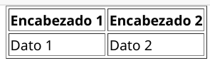
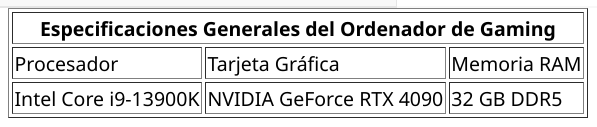
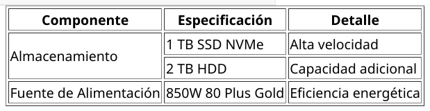
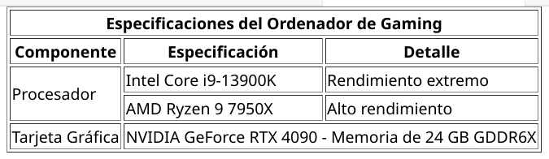
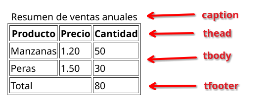
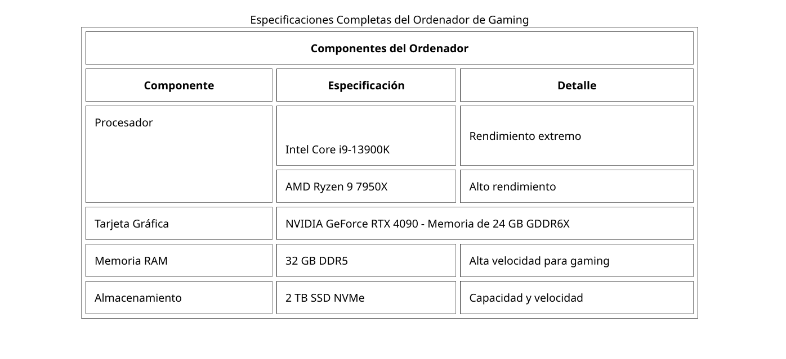

### Tablas en HTML

**1: Estructura Básica de una Tabla**

Las tablas en HTML se crean con la etiqueta `<table>`. Dentro de esta etiqueta, se estructuran las filas y columnas que componen la tabla.

```html
<table>
  <!-- Aquí se colocarán las filas de la tabla -->
</table>
```

**2: Añadir Filas a la Tabla**

Cada fila de la tabla se define con la etiqueta `<tr>` (table row). Dentro de cada fila, se colocan celdas.

```html
<table>
  <tr>
    <!-- Celdas de esta fila aquí -->
  </tr>
</table>
```

**3: Añadir Celdas a una Fila**

Las celdas se definen usando `<td>` (table data). Cada `<td>` representa una celda que contiene datos.

```html
<table>
  <tr>
    <td>Celda 1</td>
    <td>Celda 2</td>
  </tr>
</table>
```

**4: Añadir Encabezados a la Tabla**

Para añadir encabezados a la tabla, se utiliza `<th>` (table header) en lugar de `<td>`. Esto se suele hacer para la primera fila que contiene los títulos de cada columna.

```html
<table>
  <tr>
    <th>Encabezado 1</th>
    <th>Encabezado 2</th>
  </tr>
  <tr>
    <td>Dato 1</td>
    <td>Dato 2</td>
  </tr>
</table>
```
**Resultado:**


**5: Aplicar Bordes a la Tabla**

Para hacer que los bordes sean visibles, se usa el atributo `border`. Se puede establecer como `border="1"` para mostrar un borde sencillo.

```html
<table border="1">
  <tr>
    <th>Encabezado 1</th>
    <th>Encabezado 2</th>
  </tr>
  <tr>
    <td>Dato 1</td>
    <td>Dato 2</td>
  </tr>
</table>
```
**Resultado:**




**6: Combinar Columnas con `colspan`**

El atributo `colspan` se utiliza para hacer que una celda abarque varias columnas. Esto es útil cuando quieres que un encabezado o dato se extienda sobre varias columnas.

```html
<table border="1">
  <tr>
    <th colspan="3">Especificaciones Generales del Ordenador de Gaming</th>
  </tr>
  <tr>
    <td>Procesador</td>
    <td>Tarjeta Gráfica</td>
    <td>Memoria RAM</td>
  </tr>
  <tr>
    <td>Intel Core i9-13900K</td>
    <td>NVIDIA GeForce RTX 4090</td>
    <td>32 GB DDR5</td>
  </tr>
</table>
```

**Resultado:**



**7: Combinar Filas con `rowspan`**

El atributo `rowspan` se utiliza para hacer que una celda abarque varias filas. Esto es útil cuando quieres que un dato se extienda verticalmente sobre varias filas.

```html
<table border="1">
  <tr>
    <th>Componente</th>
    <th>Especificación</th>
    <th>Detalle</th>
  </tr>
  <tr>
    <td rowspan="2">Almacenamiento</td>
    <td>1 TB SSD NVMe</td>
    <td>Alta velocidad</td>
  </tr>
  <tr>
    <td>2 TB HDD</td>
    <td>Capacidad adicional</td>
  </tr>
  <tr>
    <td>Fuente de Alimentación</td>
    <td>850W 80 Plus Gold</td>
    <td>Eficiencia energética</td>
  </tr>
</table>
```

**Resultado:**



**8: `rowspan` y `colspan` Combinados**

A continuación se muestra un ejemplo donde se utilizan ambos atributos para una tabla con múltiples filas y columnas no expandidas.

```html
<table border="1">
  <tr>
    <th colspan="3">Especificaciones del Ordenador de Gaming</th>
  </tr>
  <tr>
    <th>Componente</th>
    <th>Especificación</th>
    <th>Detalle</th>
  </tr>
  <tr>
    <td rowspan="2">Procesador</td>
    <td>Intel Core i9-13900K</td>
    <td>Rendimiento extremo</td>
  </tr>
  <tr>
    <td>AMD Ryzen 9 7950X</td>
    <td>Alto rendimiento</td>
  </tr>
  <tr>
    <td>Tarjeta Gráfica</td>
    <td colspan="2">NVIDIA GeForce RTX 4090 - Memoria de 24 GB GDDR6X</td>
  </tr>
</table>
```
**Resultado:**



### Dando estructura semántica a una tabla

Las **etiquetas semánticas** en HTML son aquellas que tienen un significado claro sobre el contenido que describen. En el contexto de las tablas, HTML ofrece un conjunto de etiquetas semánticas que ayudan a estructurarlas facilitando:
* La comprensión para los desarrolladores
* La accesibilidad para los usuarios (incluidos los lectores de pantalla)
* El uso correcto de estas etiquetas facilita el diseño adaptable (responsive)

Estas etiquetas son:

1. **`<caption>`**: Proporciona un título o descripción a la tabla, que suele colocarse justo encima de ella. Es útil para describir el propósito de la tabla.

2. **`<thead>`**: Agrupa los encabezados de las columnas de una tabla. Se coloca dentro de `<table>` y contiene una o más filas (`<tr>`). Sirve para definir el encabezado de la tabla que suele ser repetido en cada página cuando se imprime.

3. **`<tbody>`**: Agrupa el contenido del cuerpo de la tabla. Se utiliza para agrupar las filas que contienen los datos de la tabla, diferenciándolas de los encabezados y el pie de la tabla.

4. **`<tfoot>`**: Agrupa el pie de la tabla, que generalmente contiene resúmenes o totales. Es útil porque se puede definir el resumen o pie de una tabla y, al imprimirse, se coloca en la parte inferior de cada página.

Ejemplo:

```html
<table>
  <caption>Resumen de ventas anuales</caption>
  <thead>
    <tr>
      <th>Producto</th>
      <th>Precio</th>
      <th>Cantidad</th>
    </tr>
  </thead>
  <tbody>
    <tr>
      <td>Manzanas</td>
      <td>1.20</td>
      <td>50</td>
    </tr>
    <tr>
      <td>Peras</td>
      <td>1.50</td>
      <td>30</td>
    </tr>
  </tbody>
  <tfoot>
    <tr>
      <td colspan="2">Total</td>
      <td>80</td>
    </tr>
  </tfoot>
</table>
```

**Resultado:**




### Atributos Adicionales para Etiquetas HTML de Tablas

#### `<table>`
  - `width`: Define el ancho de la tabla, puede ser en píxeles o porcentaje.
  
    ```html
    <table border="1" width="80%">
      <tr>
        <th>Componente</th>
        <th>Especificación</th>
      </tr>
      <tr>
        <td>Procesador</td>
        <td>Intel Core i9-13900K</td>
      </tr>
    </table>
    ```
  
  - `cellpadding`: Establece el espacio interior entre el borde de la celda y su contenido.
  
    ```html
    <table border="1" cellpadding="10">
      <tr>
        <th>Componente</th>
        <th>Especificación</th>
      </tr>
      <tr>
        <td>Tarjeta Gráfica</td>
        <td>NVIDIA GeForce RTX 4090</td>
      </tr>
    </table>
    ```
  - `cellspacing`: Define el espacio entre las celdas de la tabla.
  
    ```html
    <table border="1" cellspacing="5">
      <tr>
        <th>Componente</th>
        <th>Especificación</th>
      </tr>
      <tr>
        <td>Memoria RAM</td>
        <td>32 GB DDR5</td>
      </tr>
    </table>
    ```
  
  - `align`: Alinea la tabla (valores posibles: `left`, `right`, `center`).
  
    ```html
    <table border="1" align="center">
      <tr>
        <th>Componente</th>
        <th>Especificación</th>
      </tr>
      <tr>
        <td>Tarjeta Gráfica</td>
        <td>NVIDIA GeForce RTX 4090</td>
      </tr>
    </table>
    ```

#### `<tr>`
  - `align`: Alinea el contenido de las celdas en la fila (valores posibles: `left`, `right`, `center`).
  
    ```html
    <table border="1">
      <tr align="center">
        <th>Comp</th>
        <th>Especificación</th>
      </tr>
      <tr>
        <td>Tarjeta Gráfica</td>
        <td>NVIDIA GeForce RTX 4090</td>
      </tr>
    </table>
    ```
  - `valign`: Alinea verticalmente el contenido de las celdas (valores posibles: `top`, `middle`, `bottom`).
  
    ```html
    <table border="1">
      <tr valign="top">
        <td>Procesador</td>
        <td>Intel Core i9-13900K</td>
      </tr>
      <tr>
        <td>Tarjeta Gráfica</td>
        <td>NVIDIA GeForce RTX 4090</td>
      </tr>
    </table>
    ```

#### `<th>` y `<td>`
  - `align`: Alinea el contenido de la celda individual horizontalmente (valores posibles: `left`, `right`, `center`).
  
    ```html
    <table border="1">
      <tr>
        <th align="left">Componente</th>
        <td align="right">Tarjeta Gráfica</td>
      </tr>
    </table>
    ```
  
  - `valign`: Alinea el contenido de la celda verticalmente (valores posibles: `top`, `middle`, `bottom`).
  
    ```html
    <table border="1">
      <tr>
        <td valign="middle">Memoria RAM</td>
        <td>32 GB DDR5</td>
      </tr>
    </table>
    ```
  
  - `width`: Define el ancho de la celda.
  
    ```html
    <table border="1">
      <tr>
        <td width="200">Almacenamiento</td>
        <td>2 TB SSD NVMe</td>
      </tr>
    </table>
    ```
  
  - `height`: Define la altura de la celda.
  
    ```html
    <table border="1">
      <tr>
        <td height="50">Fuente de Alimentación</td>
        <td>850W 80 Plus Gold</td>
      </tr>
    </table>
    ```
#### `<caption>`
  - `align`: Ubica el título de la tabla al principio o al final de la misma (valores posibles: `top`, `bottom`). *(Nota: Este atributo está obsoleto en HTML5 y se recomienda usar CSS para la alineación).*
  
    ```html
    <table border="1">
      <caption align="top">Especificaciones del Ordenador de Gaming</caption>
      <tr>
        <th>Componente</th>
        <th>Especificación</th>
      </tr>
    </table>
    ```

## Ejemplo de una tabla que contiene la mayoría de los atributos y etiquetas

```html
<table border="1" width="80%" cellpadding="10" cellspacing="5" align="center">
  <caption align="top">Especificaciones Completas del Ordenador de Gaming</caption>
  <tr align="center" valign="middle">
    <th colspan="3">Componentes del Ordenador</th>
  </tr>
  <tr>
    <th>Componente</th>
    <th>Especificación</th>
    <th>Detalle</th>
  </tr>
  <tr>
    <td rowspan="2" width="200">Procesador</td>
    <td>Intel Core i9-13900K</td>
    <td height="50">Rendimiento extremo</td>
  </tr>
  <tr>
    <td>AMD Ryzen 9 7950X</td>
    <td>Alto rendimiento</td>
  </tr>
  <tr>
    <td>Tarjeta Gráfica</td>
    <td colspan="2">NVIDIA GeForce RTX 4090 - Memoria de 24 GB GDDR6X</td>
  </tr>
  <tr>
    <td>Memoria RAM</td>
    <td>32 GB DDR5</td>
    <td>Alta velocidad para gaming</td>
  </tr>
  <tr>
    <td>Almacenamiento</td>
    <td>2 TB SSD NVMe</td>
    <td>Capacidad y velocidad</td>
  </tr>
</table>
```

**Resultado**:



