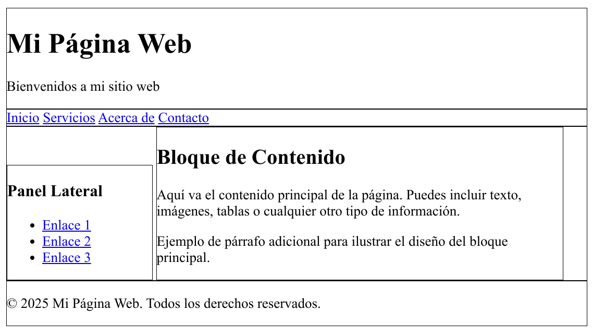
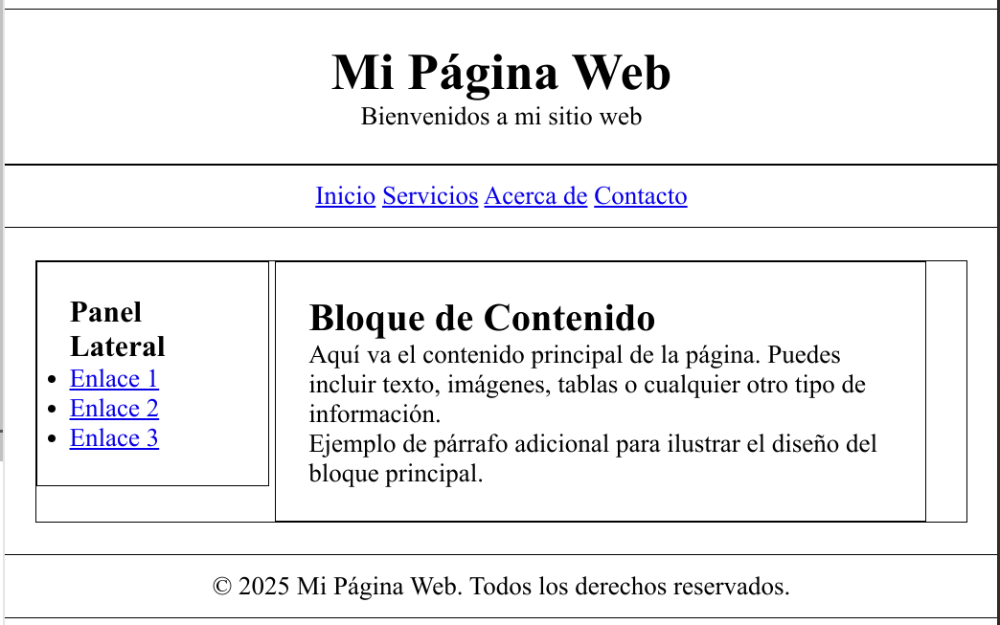

# Ejemplo de maquetado web

Vamos a crear paso a paso una web y vamos a organizarla y estructurarla utilizando los conceptos del modelo de cajas y las propiedades de maquetado que hemos visto.

## Estructura de la web

Partiremos de una estructura básica de una web compuesta de:
* Un encabezado
* Una barra de navegación
* Un panel lateral
* Un bloque de contenido
* El pie de página

El HTML de dicha página es el siguiente:

```html
<div class="banner">
    <h1>Mi Página Web</h1>
    <p>Bienvenidos a mi sitio web</p>
</div>
<div class="navbar">
    <a href="#">Inicio</a>
    <a href="#">Servicios</a>
    <a href="#">Acerca de</a>
    <a href="#">Contacto</a>
</div>
<div class="container">
    <div class="sidebar">
        <h3>Panel Lateral</h3>
        <ul>
            <li><a href="#">Enlace 1</a></li>
            <li><a href="#">Enlace 2</a></li>
            <li><a href="#">Enlace 3</a></li>
        </ul>
    </div>
    <div class="content">
        <h2>Bloque de Contenido</h2>
        <p>Aquí va el contenido principal de la página. Puedes incluir texto, imágenes, tablas o cualquier otro tipo de información.</p>
        <p>Ejemplo de párrafo adicional para ilustrar el diseño del bloque principal.</p>
    </div>
</div>
<div class="footer">
    <p>© 2025 Mi Página Web. Todos los derechos reservados.</p>
</div>
```

### Explicación

La web está compuesta de 4 "cajas principales":
* `banner`: para el encabezado
* `navbar`: para la barra/menú de navegación
* `container`: Incluye a su vez dos cajas:
  * `sidebar`: para el panel lateral.
  * `content`: para el contenido principal de la web.
* `footer`: para el pié de página.

## Dando estructura al documento con css

Para que los elementos de la web se dispongan de la manera deseada aplicamos los siguientes estilos iniciales:

```css
    .banner,
    .navbar,
    .container,
    .sidebar,
    .content,
    .footer {  
      border: 1px solid black;
    }
    .sidebar,
    .content{
      display: inline-block;
    }

    .sidebar {
      width: 25%; 
    }

    .content {
      width: 70%;
    }
```
El resultado debe ser similar al siguiente:



### Explicación
* Ponemos **borde** a todos los bloques para ver el alcance de los mismos. Lo eliminaremos del resultado final.
* Todos los `div` (salvo `sidebar` y `content`) por defecto usan el valor `block` en la propiedad `display` por lo que no es necesario especificarlo. Esta disposición hace que los `div` se apilen uno debajo de otro.
* Los `div` de las clases `sidebar` y  `content` tienen la propiedad `display` con el valor `inline-block` para que se muestren en línea y poder aplicarles ancho y/o alto.
* Ponemos `width` a los bloques contenidos en `content` para repartir el ancho de cada uno en pantalla y para asegurarnos de que en conjunto ocupen menos de un **100%** del ancho y garantizar que no acaben apilados si no existe suficiente ancho para mostrarlos.

## Mejorando la disposición de los elementos

Para mejorar la disposición de los elementos añadimos/modificamos lo siguiente a la hoja de estilos:

```css
* {
  margin: 0;
  padding: 0;
  box-sizing: border-box;
}
.banner,
.navbar,
.container,
.sidebar,
.content,
.footer {
  border: 1px solid black;
}
.banner {
  padding: 20px 0;
  text-align: center;
}
.navbar {
  padding: 10px;
  text-align: center;
}
.container {
  margin: 20px;
}
.sidebar,
.content {
  display: inline-block;
  vertical-align: top;
  padding: 20px;
}
.sidebar {
  width: 25%;
}
.content {
  width: 70%;
}
.footer {
  padding: 10px;
  text-align: center;
}
```
El resultado debe ser:



### Explicación

De forma global aplicamos a todos los elementos los siguientes estilos:

```css
* {
  margin: 0;
  padding: 0;
  box-sizing: border-box;
}
```
Con ello conseguimos que:
* Los elementos de bloque como `<h1>`, `<p>`, `<div>`, `<ul>`,...a los que cada navegador suele aplicar márgenes predeterminados tengan por defecto margen y separación `0` con lo que conseguimos tener más control sobre el diseño y reducir las diferencias visuales entre navegadores.
* Poner por defecto `box-sizing: border-box;` facilita no tener que ajustar los tamaños de los bloques manualmente y nos aseguramos que los anchos de `border`, `padding` y contenido se ajustan al asignado al bloque.

El resto de modificaciones consisten en
* Poner `padding` y `margin` a algunos bloques para mejorar la distribución visual de los elementos.
* Se alinea verticalmente arriba el panel lateral..
* Se centran algunos textos. 

