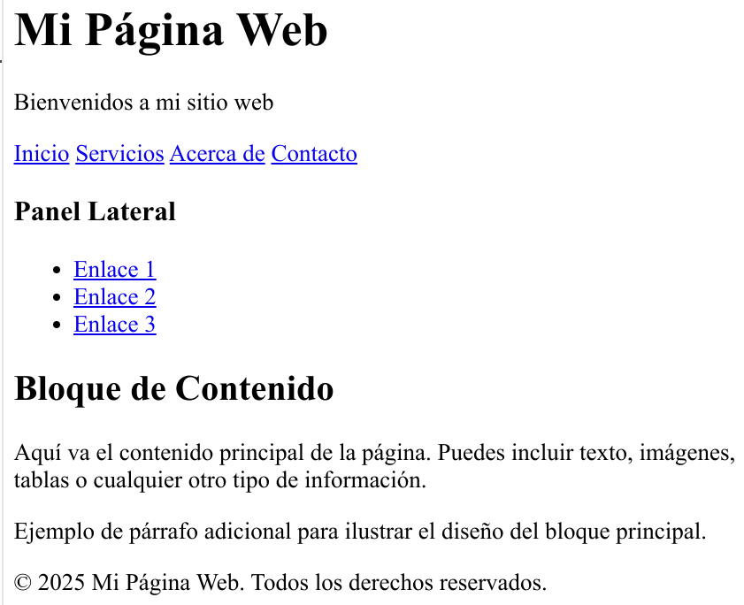
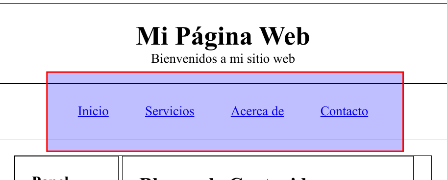
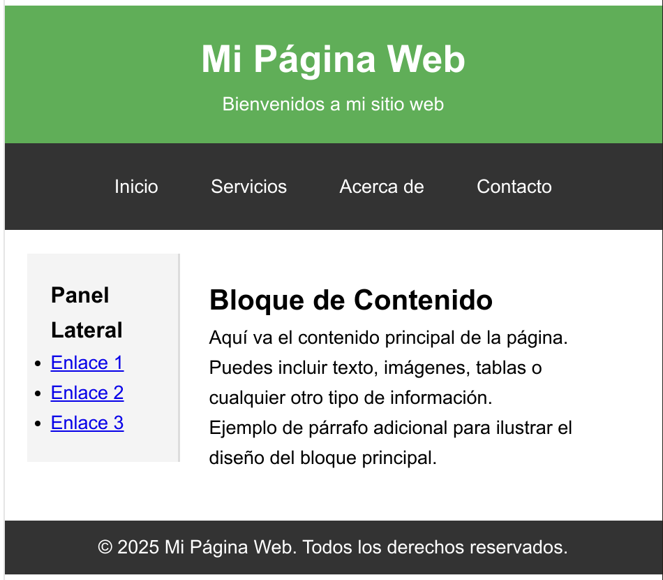
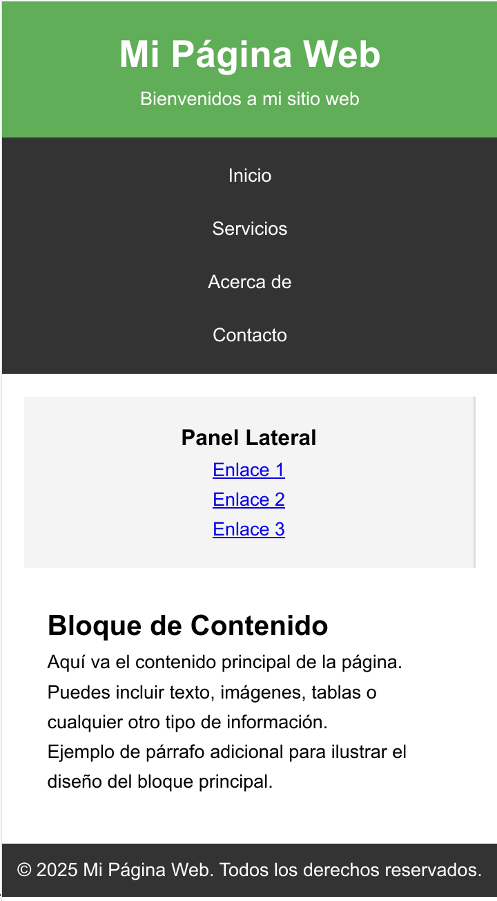
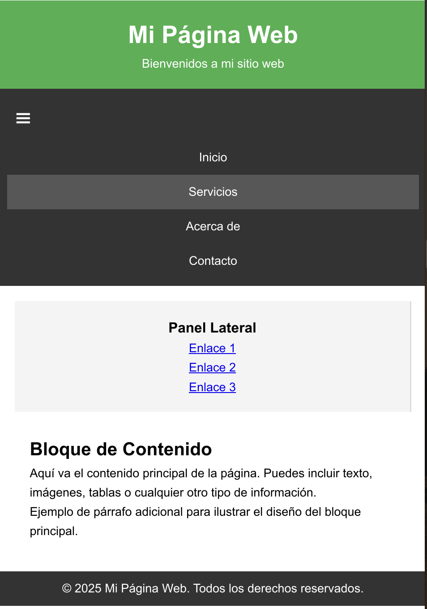

# Ejemplo de maquetado web

Vamos a crear paso a paso una web y vamos a organizarla y estructurarla utilizando los conceptos del modelo de cajas y las propiedades de maquetado que hemos visto.

## Estructura de la web

Partiremos de una estructura básica de una web compuesta de:
* Un encabezado
* Una barra de navegación
* Un panel lateral
* Un bloque de contenido
* El pie de página

El HTML de dicha página es el siguiente:

```html
<div class="banner">
    <h1>Mi Página Web</h1>
    <p>Bienvenidos a mi sitio web</p>
</div>
<div class="navbar">
    <a href="#">Inicio</a>
    <a href="#">Servicios</a>
    <a href="#">Acerca de</a>
    <a href="#">Contacto</a>
</div>
<div class="container">
    <div class="sidebar">
        <h3>Panel Lateral</h3>
        <ul>
            <li><a href="#">Enlace 1</a></li>
            <li><a href="#">Enlace 2</a></li>
            <li><a href="#">Enlace 3</a></li>
        </ul>
    </div>
    <div class="content">
        <h2>Bloque de Contenido</h2>
        <p>Aquí va el contenido principal de la página. Puedes incluir texto, imágenes, tablas o cualquier otro tipo de información.</p>
        <p>Ejemplo de párrafo adicional para ilustrar el diseño del bloque principal.</p>
    </div>
</div>
<div class="footer">
    <p>© 2025 Mi Página Web. Todos los derechos reservados.</p>
</div>
```
 Y su apariencia antes de aplicar ningún estilo:

 

### Explicación

La web está compuesta de 4 "cajas principales":
* `banner`: para el encabezado
* `navbar`: para la barra/menú de navegación
* `container`: Incluye a su vez dos cajas:
  * `sidebar`: para el panel lateral.
  * `content`: para el contenido principal de la web.
* `footer`: para el pié de página.

Observa también que por defecto el navegador aplica estilos de forma predeterminada a los diferentes elementos:

* Tipo de fuente 
* Tamaño de la fuente.
* Márgenes y separaciones.
* Subrayado y color a los enlaces.
* Viñeta en las listas no numeradas.

## Dando estructura al documento con css

Para que los elementos de la web se dispongan de la manera deseada aplicamos los siguientes estilos iniciales:

```css
    .banner,
    .navbar,
    .container,
    .sidebar,
    .content,
    .footer {  
      border: 1px solid black;
    }
    .sidebar,
    .content{
      display: inline-block;
    }

    .sidebar {
      width: 25%; 
    }

    .content {
      width: 70%;
    }
```
El resultado debe ser similar al siguiente:


### Explicación
* Ponemos **borde** a todos los bloques para ver el alcance de los mismos. Lo eliminaremos del resultado final.
* Todos los `div` (salvo `sidebar` y `content`) por defecto usan el valor `block` en la propiedad `display` por lo que no es necesario especificarlo. Esta disposición hace que los `div` se apilen uno debajo de otro.
* Los `div` de las clases `sidebar` y  `content` tienen la propiedad `display` con el valor `inline-block` para que se muestren en línea y poder aplicarles ancho y/o alto.
* Ponemos `width` a los bloques contenidos en `content` para repartir el ancho de cada uno en pantalla y para asegurarnos de que en conjunto ocupen menos de un **100%** del ancho y garantizar que no acaben apilados si no existe suficiente ancho para mostrarlos.

## Mejorando la disposición de los elementos

Para mejorar la disposición de los elementos añadimos/modificamos lo siguiente a la hoja de estilos:

```css
* {
  margin: 0;
  padding: 0;
  box-sizing: border-box;
}
.banner,
.navbar,
.container,
.sidebar,
.content,
.footer {
  border: 1px solid black;
}
.banner {
  padding: 20px 0;
  text-align: center;
}
.navbar {
  padding: 10px;
  text-align: center;
}
.container {
  margin: 20px;
}
.sidebar,
.content {
  display: inline-block;
  vertical-align: top;
  padding: 20px;
}
.sidebar {
  width: 25%;
}
.content {
  width: 70%;
}
.footer {
  padding: 10px;
  text-align: center;
}
```
El resultado debe ser:


### Explicación

De forma global aplicamos a todos los elementos los siguientes estilos:

```css
* {
  margin: 0;
  padding: 0;
  box-sizing: border-box;
}
```
Con ello conseguimos que:
* Los elementos de bloque como `<h1>`, `<p>`, `<div>`, `<ul>`,...a los que cada navegador suele aplicar márgenes predeterminados tengan por defecto margen y separación `0` con lo que conseguimos tener más control sobre el diseño y reducir las diferencias visuales entre navegadores.
* Poner por defecto `box-sizing: border-box;` facilita no tener que ajustar los tamaños de los bloques manualmente y nos aseguramos que los anchos de `border`, `padding` y contenido se ajustan al asignado al bloque.

El resto de modificaciones consisten en
* Poner `padding` y `margin` a algunos bloques para mejorar la distribución visual de los elementos.
* Se alinea verticalmente arriba el panel lateral..
* Se centran algunos textos.

## Maquetando la barra de navegación

Añadimos la siguiente configuración de estilos a los enlaces de la barra de navegación:

```css
.navbar a {
  display: inline-block;
  padding: 14px 20px;
}
```


Los enlaces tienen como valor por defecto `inline` para la propiedad `display`. Al cambiarlo a `inline-block` conseguimos que se aplique el `padding` a los enlaces sin que afecte a los elementos de alrededor y que los enlaces tengan un área más amplia a la hora de interactuar con ellos.

## Modificando colores y apariencia

Modificamos los estilos para que queden los siguientes:

```css
* {
      margin: 0;
      padding: 0;
      box-sizing: border-box;
    }

    body {
      font-family: Arial, sans-serif;
      line-height: 1.6;
    }


    .banner {
      padding: 20px 0;
      text-align: center;
      background-color: #4CAF50;
      color: white;
    }

    .navbar {
      padding: 10px;
      text-align: center;
      background-color: #333;
    }

    .navbar a {
      display: inline-block;
      padding: 14px 20px;
      color: white;
      text-decoration: none;
    }

    .navbar a:hover {
      background-color: #575757;
    }

    .container {
      margin: 20px;
    }

    .sidebar,
    .content {
      display: inline-block;
      vertical-align: top;
      padding: 20px;
    }

    .sidebar {
      width: 25%;
      background-color: #f4f4f4;
      border-right: 2px solid #ddd;
    }

    .content {
      width: 70%;
    }

    .footer {
      padding: 10px;
      text-align: center;
      background-color: #333;
      color: white;
    }
```

El resultado debería ser similar a:



### Explicación

* Eliminamos los bordes de los bloques. Se usaban hasta ahora como guía para ver el alcance de los mismos.
* Aplicamos una fuente y un alto de línea común a todo los textos de la página.
* Cambiamos color del fondo y del texto del encabezado.
* Ponemos color de fondo a la barra de navegación.
* Aplicamos al selector `.navbar a:hover` un color de fondo más claro que el color de fondo de la barra de navegación. Con ello conseguimos que al pasar el ratón por encima de los enlaces el fondo cambie de color. 
* Cambiamos el color de la fuente de los enlaces de la barra de navegación y les eliminamos el subrayado.
* Cambiamos color de fondo del panel lateral y le ponemos borde en la parte derecha.
* Aplicamos al pie de paǵina el mismo color de fondo y de letra que a la barra de navegación

## Haciendo nuestro diseño responsivo

Una web responsiva es un sitio web diseñado para adaptarse automáticamente a diferentes tamaños de pantalla y dispositivos (como PCs de escritorio, tabletas y teléfonos móviles), proporcionando una experiencia de usuario óptima sin importar el medio de acceso.

Para ello vamos a utilizar los **media queries** son una característica de CSS que permite aplicar estilos específicos a una página web según ciertas condiciones, como:
* El tamaño de la pantalla
* La resolución
* La orientación del dispositivo
* El tipo de dispositivo.

En este caso vamos a modificar los estilos de algunos elementos para el caso de que el ancho de pantalla sea menor de un valor de `768px`

Añadimos a los estilos actuales los siguientes:

```css
@media (max-width: 768px) {
    .navbar a {
        display: block;
        padding: 10px;
    }
    .sidebar,
    .content {
        display: block;
        width: 100%;
        margin: 0;
    }
    .sidebar{
      text-align: center;
    }
    .sidebar ul {
      list-style-type: none;
  }
    .content {
        margin-top: 10px;
    }
}
```

El resultado al estrechar la pantalla debe ser similar a:



### Explicación

* Todos los elementos que tienen `display` a `inline-block` en un ancho de pantalla grande pasan a `block` para que se muestren apilados uno encima de otro.
* El contenido y el panel lateral ocupan ahora el ancho completo de la pantalla. 
* Se cambian algunos márgenes y separaciones para disminuir la separación de algunos elementos.
* Se centra el texto del panel lateral y se eliminan las viñetas de la lista.

## Añadiendo menú tipo hamburguesa para la barra de navegación

Está versión completa la anterior añadiendo el menú de hamburguesa en el modo de pantalla de dispositivo móvil:

```html
<!DOCTYPE html>
<html lang="en">

<head>
  <meta charset="UTF-8">
  <meta name="viewport" content="width=device-width, initial-scale=1.0">
  <title>Document</title>
  <style>
    * {
      margin: 0;
      padding: 0;
      box-sizing: border-box;
    }

    body {
      font-family: Arial, sans-serif;
      line-height: 1.6;
    }


    .banner {
      padding: 20px 0;
      text-align: center;
      background-color: #4CAF50;
      color: white;
    }

    .navbar {
      padding: 10px;
      text-align: center;
      background-color: #333;
    }

    .navbar a {
      display: inline-block;
      padding: 14px 20px;
      color: white;
      text-decoration: none;
    }

    .navbar a:hover {
      background-color: #575757;
    }

    .container {
      margin: 20px;
    }

    .sidebar,
    .content {
      display: inline-block;
      vertical-align: top;
      padding: 20px;
    }

    .sidebar {
      width: 25%;
      background-color: #f4f4f4;
      border-right: 2px solid #ddd;
    }

    .content {
      width: 70%;
    }

    .footer {
      padding: 10px;
      text-align: center;
      background-color: #333;
      color: white;
    }

    /* Menú hamburguer */
    .hamburger {
      display: none;
      cursor: pointer; /* muestra mano como cursor al pasar por encima */
      font-size: 24px;
      color: white;
      padding: 10px;
      text-align: left;
    }

    .navbar-menu {
      display: block;
    }

    @media (max-width: 768px) {
      .navbar a {
        display: block;
        padding: 10px;
      }

      .sidebar,
      .content {
        display: block;
        width: 100%;
        margin: 0;
      }

      .sidebar {
        text-align: center;
      }

      .sidebar ul {
        list-style-type: none;
      }

      .content {
        margin-top: 10px;
      }

      /* hamburguer menu */
      .hamburger {
        display: block;
      }

      .navbar-menu {
        display: none; /* Por defecto se oculta el menú de navegación */
        width: 100%;
        text-align: center;
        background-color: #333;
      }
      .navbar-menu.active {
        display: block; /* mostramos menú de navegacion que por defecto está oculto en pantallas pequeñas */
      }

    }
  </style>
  <script>
    function toggleMenu() {
      const menu = document.querySelector('.navbar-menu');
      menu.classList.toggle('active');
    }
  </script>
</head>

<body>
  <div class="banner">
    <h1>Mi Página Web</h1>
    <p>Bienvenidos a mi sitio web</p>
  </div>

  <div class="navbar">
    <span class="hamburger" onclick="toggleMenu()">&#9776;</span>
    <div class="navbar-menu">
      <a href="#">Inicio</a>
      <a href="#">Servicios</a>
      <a href="#">Acerca de</a>
      <a href="#">Contacto</a>
    </div>
  </div>

  <div class="container">
    <div class="sidebar">
      <h3>Panel Lateral</h3>
      <ul>
        <li><a href="#">Enlace 1</a></li>
        <li><a href="#">Enlace 2</a></li>
        <li><a href="#">Enlace 3</a></li>
      </ul>
    </div>

    <div class="content">
      <h2>Bloque de Contenido</h2>
      <p>Aquí va el contenido principal de la página. Puedes incluir texto, imágenes, tablas o cualquier otro tipo de
        información.</p>
      <p>Ejemplo de párrafo adicional para ilustrar el diseño del bloque principal.</p>
    </div>
  </div>

  <div class="footer">
    <p>© 2025 Mi Página Web. Todos los derechos reservados.</p>
  </div>
</body>

</html>
```

No se explica con mucho detalle porque este código va más allá de los contenidos del módulo. De forma general, los cambios que se han aplicado son:

* El menú de hamburguesa se muestra en la barra de navegación solo para anchos de pantalla reducidos. Y consiste en un simple caracter `☰` con el tamaño adecuado.
* Al pasar el cursos por encima de la hamburguesa este se convierte en una mano.
* Al hacer click en la hamburguesa se despliega el menú. Al volver a hacer click se oculta.
* El bloque del menú de navegación se mete dentro de otro bloque para permitir ocultarlo/mostrarlo en modo responsive
* Se añade javscript que añade/elimina clase en el menú de navegación que hace que el bloque con los enlaces se muestre o se oculte.

