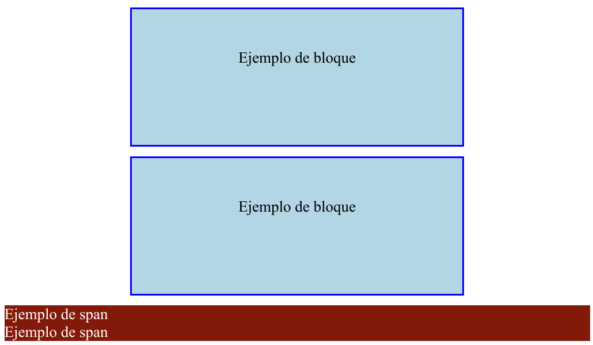

# Maquetación en css

La **maquetación** en CSS es el proceso de **organizar** y **estructurar** los elementos de una página web para que se dispongan visualmente sw forma **coherente, atractiva y funcional**. 

Esto implica definir cómo se distribuyen, alinean y adaptan los elementos en el espacio disponible, considerando diferentes dispositivos, resoluciones y tamaños de pantalla.

Para establecer los mecanismos básicos maquetación (layout) se utiliza una propiedad llamada **`display`** que, aunque no la hayamos utilizando explícitamente hasta ahora, está actuando por omisión.

## La propiedad `display`

Todos los elementos HTML tienen una forma por defecto de comportarse a la hora de renderizarse (dibujarse) en el navegador. Algunos elementos HTML como `<div>` o `<p>` actuan de una forma, y otros elementos como `<a>` o `<span>` de otra forma diferente.

Esa forma de comportarse al dibujarse un  elemento en el navegador puede cambiarse a través de la propiedad CSS **display**, indicandole un **tipo de representación concreta**

De forma resumida, algunos de los valores posibles que puede tener la propiedad display son:

| **Valor**         | **Descripción**                                                                                                 |
|--------------------|-----------------------------------------------------------------------------------------------------------------|
| `block`           | El elemento se comporta como un bloque. Ocupa todo el ancho disponible y comienza en una nueva línea.           |
| `inline`          | El elemento se comporta como en línea. Solo ocupa el ancho necesario y no inicia una nueva línea.               |
| `inline-block`    | Similar a `inline`, pero permite aplicar dimensiones (ancho y alto).                                            |
| `flex`            | Activa el modelo de **Flexbox** para el elemento, permitiendo diseños unidimensionales (filas o columnas).      |
| `grid`            | Activa el modelo de **CSS Grid**, ideal para diseños bidimensionales (filas y columnas).                       |
| `inline-flex`     | Similar a `flex`, pero el contenedor se comporta como un elemento en línea.                                     |
| `inline-grid`     | Similar a `grid`, pero el contenedor se comporta como un elemento en línea.                                     |
| `table`           | El elemento se comporta como una tabla HTML.                                                                   |
| `table-row`       | El elemento se comporta como una fila de tabla (`<tr>`).                                                       |
| `table-cell`      | El elemento se comporta como una celda de tabla (`<td>` o `<th>`).                                             |
| `list-item`       | El elemento se comporta como un elemento de lista (`<li>`) con estilo de marcador (si corresponde).            |
| `none`            | El elemento no se muestra y no ocupa espacio en el diseño.                                                    |
| `contents`        | Solo se muestra el contenido del elemento, pero no su caja contenedora.                                        |

Vamos a ver explicación de los más básicos

### `inline`

El valor **`inline`** de la propiedad display hace que un elemento se comporte como un elemento **en línea**. 

Esto significa que el elemento ocupa solo el espacio necesario para su contenido y no inicia una nueva línea en el diseño, permitiendo que otros elementos se alineen junto a él, horizontalmente.

Como norma general es el valor del `display` por defecto de todos los elementos HTML que suelen aparecer dentro de un párrafo.

#### Características principales de `inline`:

1. Dimensiones
   - No admite directamente las propiedades de `width` y `height`. El tamaño del elemento depende únicamente del contenido que contiene.
   - Ejemplo:
     ```css
     span {
       display: inline;
       width: 100px; /* No tiene efecto */
       height: 50px; /* No tiene efecto */
     }
     ```

2. Modelo de cajas
   - Respeta **padding**, **margin**, y **border**.
   - Sin embargo, el **padding** y **border** no afectan la disposición de otros elementos. Por ejemplo, el espacio generado por `padding` no empuja a otros elementos hacia abajo.

3. Flujo del documento
   - Permanece en el flujo normal del contenido, es decir, no interrumpe la alineación ni crea bloques.
   - Los elementos que lo rodean fluyen a su lado.

4. Elementos predeterminados con `display: inline`
   - Algunos elementos HTML que tienen `inline` como valor predeterminado:
     - `<span>`, `<a>`, `<strong>`, `<em>`, `<b>`, `<i>`, `<u>`.

5. Estilo visual
   - Los elementos `inline` están diseñados principalmente para estilizar texto o contenido pequeño que forma parte de una línea de texto.

#### Ejemplos

Como hemos visto, todos los elementos `<span>` se comportan como elementos en línea (inline), mientras que los elementos `<div>` por defecto se comportan como elementos en **bloque** (lo explicaremos en el siguiente apartado):

Por tanto, si aplicamos los estilos:

```css
div {
  background: darkblue;
  color: white;
}
    
span {
  background: darkred;
  color: white;
}
```

Al html:

```html
<div>Ejemplo de bloque</div>
<div>Ejemplo de bloque</div>
<span>Ejemplo de span</span>
<span>Ejemplo de span</span>
```
los elementos `<div>` se comportan como si tuvieran un `display: block` y los elementos `<span>` se comportan como si tuvieran un `display: inline`.


Pero podemos forzar y cambiar la propiedad display, por ejemplo de los elementos `div` para que se muestren en línea:

```css
div {
  background: darkblue;
  color: white;
  display: inline;       /* forzamos div a mostrarse en línea */
}
    
span {
  background: darkred;
  color: white;
}
```


Aahora, tanto `<div>` como `<span>` se comportan de la misma forma: como un elemento en línea.

### `block`

El valor **`block`** de la propiedad `display` hace que un elemento se comporte como un **bloque** en el flujo del documento. Este es el comportamiento predeterminado de muchos elementos HTML, como `<div>`, `<p>`, `<section>`, `<article>`, entre otros.

#### Características principales de `block`

1. Los elementos se apilan uno encima de otros (en vertical) y siempre comienzan en una nueva línea

2. Por defecto ocupan todo el ancho (en horizontal)disponible.

3. Ancho y alto configurables. Si usa,ps `width` (ancho) y `height` (alto) se aplica al tamño del elemento.


#### Elementos predeterminados con `display: block`
Algunos ejemplos de elementos que tienen `display: block` por defecto:
- **Elementos estructurales `<div>`, `<section>`, `<header>`, `<footer>`, `<article>`, `<aside>`, `<main>`.
- **Elementos de texto y contenido `<p>`, `<h1>` a `<h6>`, `<ul>`, `<ol>`, `<li>`.
- **Elementos multimedia `<figure>`, `<figcaption>`.

#### Ejemplo

```html
<!DOCTYPE html>
<html lang="es">

<head>
    <meta charset="UTF-8">
    <meta name="viewport" content="width=device-width, initial-scale=1.0">
    <title>Ejemplo de display: block</title>
    <style>
        div {
            width: 300px;
            height: 100px;
            margin: 10px auto;
            padding: 20px;
            background-color: lightblue;
            border: 2px solid blue;
            text-align: center;
            line-height: 60px;
        }

        span {
            background: darkred;
            color: white;
            display: block;
            /* Display por defecto modificado */
        }
    </style>
</head>

<body>
    <div>Ejemplo de bloque</div>
    <div>Ejemplo de bloque</div>
    <span>Ejemplo de span</span>
    <span>Ejemplo de span</span>
</body>

</html>
```




### `inline-block`

Si utilizamos la propiedad display con el valor `inline-block`, conseguiremos un elemento que funcionará como si fuera un elemento `inline`, pero obedeciendo a las propiedades `width` y `height`, que se ignoran si estamos utilizando un `display: inline`.

Se trata de una especie de híbrido entre inline y block.

#### Ejemplo

```html
<!DOCTYPE html>
<html lang="es">

<head>
    <meta charset="UTF-8">
    <meta name="viewport" content="width=device-width, initial-scale=1.0">
    <title>Ejemplo de display: block</title>
    <style>
        div {
          background: darkblue;
          color: white;
        }
        
        span {
          background: darkred;
          color: white;
          width: 200px;
        }
        
        .inline-block {
          background: green;
          color: white;
          display: inline-block;
          width: 300px;
        }
    </style>
</head>

<body>
    <div>Ejemplo de bloque</div>
    <div>Ejemplo de bloque</div>
    <span>Ejemplo de span</span>
    <span>Ejemplo de span</span>
    <span class="inline-block">Ejemplo de inline-block</span>
    <span class="inline-block">Ejemplo de inline-block</span>
</body>

</html>
```


Observa que en el caso del elemento `<span>` (inline), el navegador ignora las dimensiones de ancho que le hemos indicado, al contrario que en el elemento `inline-block`. 

El valor `inline-block` nos puede venir muy bien cuando necesitamos una mezcla de ambos: donde se comporte como un inline pero que haga caso a las medidas de dimensión como los block.

### `none`

Mediante el valor especial none podemos indicar a la propiedad display que el navegador no debe renderizar (dibujar) el elemento ni sus hijos y, aunque exista en el HTML, no se mostrará.