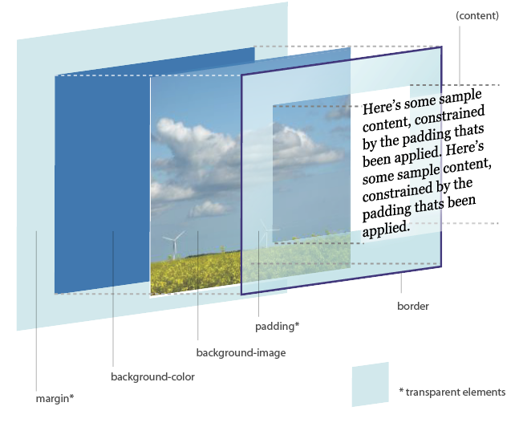
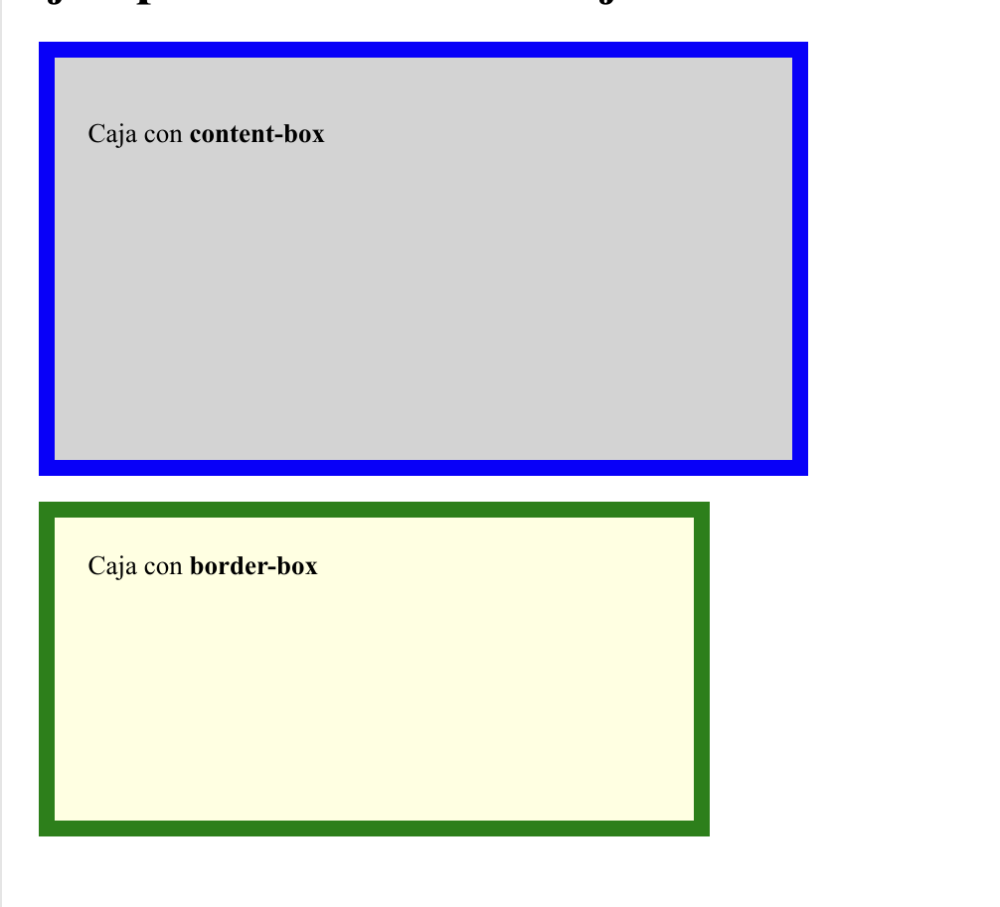

# Modelo de cajas en css

El **modelo de cajas en CSS** (CSS Box Model) es el concepto fundamental que describe cómo los elementos HTML se **representan** y **estructuran en la página web**. Cada elemento se trata como una caja rectangular compuesta por las siguientes capas, desde fuera hacia dentro:



## 1. Content (Contenido)

- Es el área donde se muestra el contenido del elemento, como texto, imágenes o elementos hijos.
- Su tamaño está determinado por las propiedades como `width` y `height`.
- Ejemplo: Si defines `width: 200px; height: 100px;`, este será el tamaño del área del contenido.

## 2. Padding (Relleno)

- Es el espacio entre el contenido y el borde del elemento.
- Se puede definir en píxeles, porcentajes u otras unidades.
- Propiedades relacionadas: `padding-top`, `padding-right`, `padding-bottom`, `padding-left`.
- Ejemplo:
    ```css
    padding: 10px; /* Aplica 10px de espacio alrededor del contenido */
    ```

## 3. Border (Borde) 

- Rodea el contenido y el padding, formando un contorno alrededor del elemento.
- Su grosor, estilo y color se controlan mediante las propiedades `border-width`, `border-style` y `border-color`.
- Ejemplo:

     ```css
     border: 2px solid black; /* Borde negro de 2px de grosor */
     ```


## 4. Margin (Margen) 

- Es el espacio externo que separa la caja de otros elementos.
- No tiene color ni estilo, es completamente transparente.
- Propiedades relacionadas: `margin-top`, `margin-right`, `margin-bottom`, `margin-left`.
- Ejemplo:
     ```css
     margin: 20px; /* Espacio de 20px alrededor del elemento */
     ```

## Relación entre estas capas:

- Cada elemento ocupa un espacio total que es la **suma** de:
  - El contenido (`content`),
  - El relleno (`padding`),
  - El borde (`border`),
  - Y el margen (`margin`).


## Diagrama de la caja 


## Tipos de modelos de cajas 
Hay dos modelos principales:

1. **`content-box`** (Por defecto) 
   - El `width` y `height` solo incluyen el contenido. El padding y el borde se añaden fuera del tamaño especificado.
   - Ejemplo:
     ```css
     width: 100px; /* Solo mide el contenido */
     padding: 10px;
     border: 5px solid black;
     /* Tamaño total: 100px (contenido) + 10px * 2 (padding) + 5px * 2 (borde) = 130px */
     ```

2. **`border-box`** 
   - El `width` y `height` incluyen el contenido, el padding y el borde.
   - Ejemplo:
     ```css
     box-sizing: border-box; /* Incluye todo dentro del tamaño especificado */
     width: 100px; /* El tamaño total será de 100px, distribuyendo espacio entre contenido, padding y borde */
     ```

El margen siempre se encuentra **fuera de la caja** y no forma parte de las dimensiones calculadas del elemento (ni en **content-box** ni en **border-box**).

## Ejemplo

Aquí tienes un ejemplo práctico para entender cómo funciona el **modelo de cajas en CSS** con `content-box` (por defecto) y `border-box`. 

### Código HTML y CSS:
```html
<!DOCTYPE html>
<html lang="es">
<head>
  <meta charset="UTF-8">
  <meta name="viewport" content="width=device-width, initial-scale=1.0">
  <title>Modelo de cajas</title>
  <style>
    /* Ejemplo con content-box (por defecto) */
    .content-box {
      width: 400px;
      height: 200px;
      padding: 20px;
      border: 10px solid blue;
      margin: 15px;
      box-sizing: content-box; /* No es necesario especificarlo porque es el valor predeterminado */
      background-color: lightgray;
    }

    /* Ejemplo con border-box */
    .border-box {
      width: 400px;
      height: 200px;
      padding: 20px;
      border: 10px solid green;
      margin: 15px;
      box-sizing: border-box; /* Incluye padding y border en el tamaño total */
      background-color: lightyellow;
    }
  </style>
</head>
<body>
  <h1>Ejemplo del modelo de cajas</h1>
  <div class="content-box">Caja con <strong>content-box</strong></div>
  <div class="border-box">Caja con <strong>border-box</strong></div>
</body>
</html>
```

---

### Explicación:

#### **1. Primera caja (`content-box`)**
- **Tamaño del contenido**: 400px de ancho y 200px de alto.
- **Padding**: 20px (agregado fuera del tamaño del contenido).
- **Borde**: 10px (también agregado fuera del tamaño del contenido).
- **Margen**: 15px (separación externa, no afecta el tamaño total).

**Tamaño total de la caja**:
- Ancho: 400px (contenido) + 20px * 2 (padding) + 10px * 2 (borde) = **460px**.
- Alto: 200px (contenido) + 20px * 2 (padding) + 10px * 2 (borde) = **260px**.

---

#### **2. Segunda caja (`border-box`)**
- **Tamaño total fijo**: 400px de ancho y 200px de alto, incluyendo contenido, padding y borde.
- **Padding y borde**: Se ajustan dentro de las dimensiones especificadas.

**Tamaño del contenido real**:
- Ancho: 400px - (20px * 2 padding + 10px * 2 borde) = **340px**.
- Alto: 200px - (20px * 2 padding + 10px * 2 borde) = **160px**.


### Visualización:


Cuando abres el código en un navegador, notarás que:

1. La caja con `content-box` es más grande porque el padding y el borde se agregan al tamaño total.
2. La caja con `border-box` respeta el tamaño total especificado, ajustando el espacio interno.

