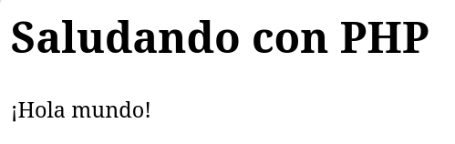
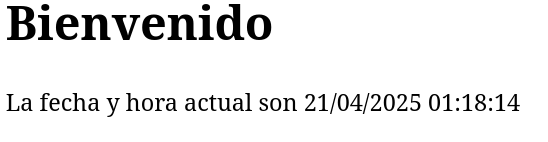
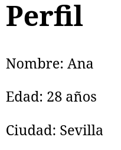
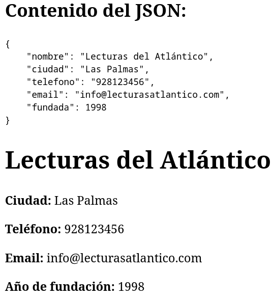
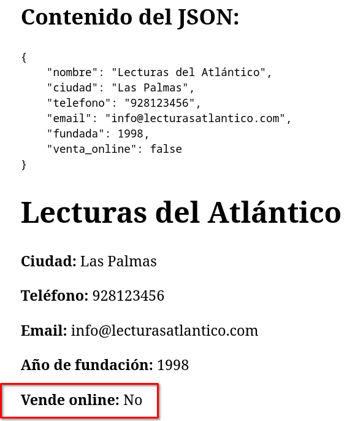
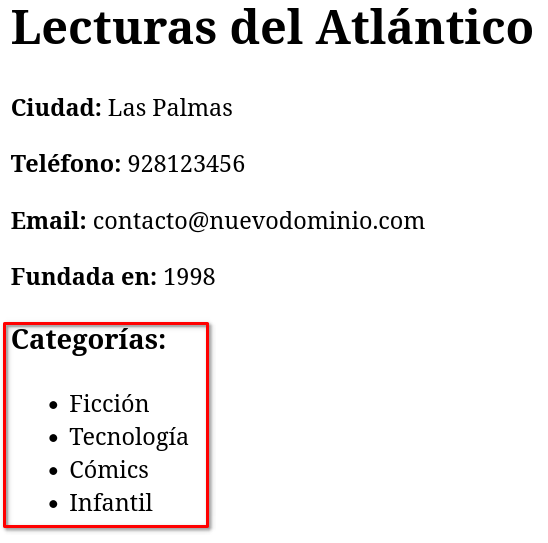
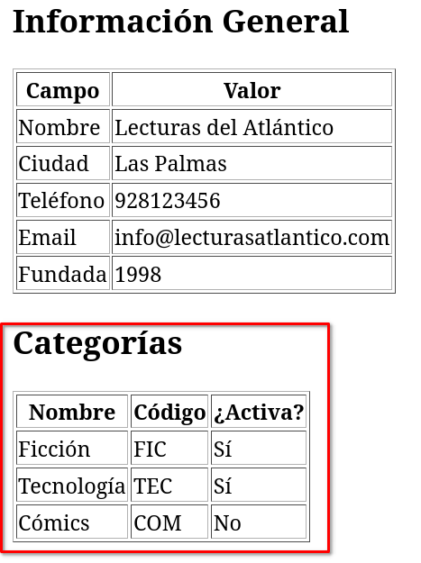
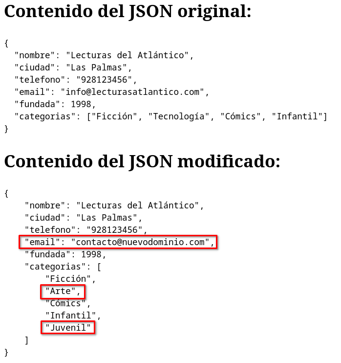
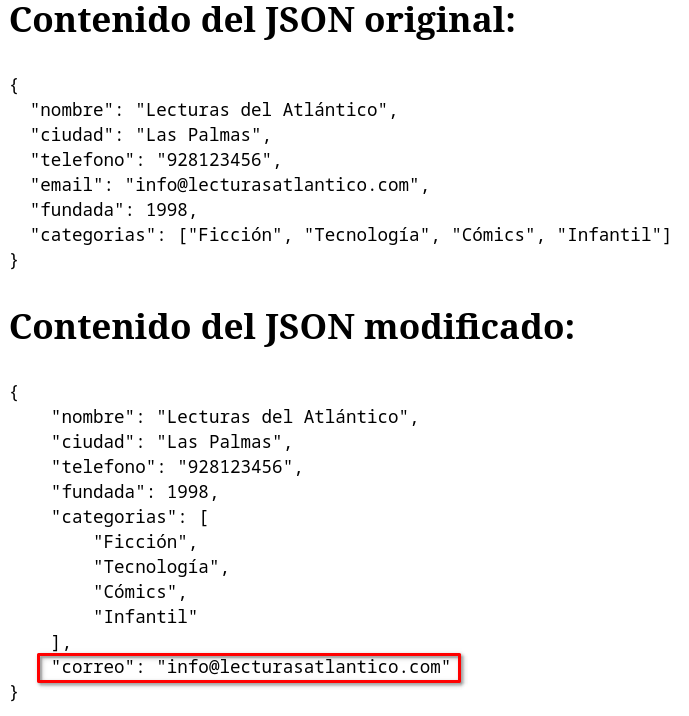

# Usando PHP para acceder a JSON

## ¿Qué es PHP?

PHP es un lenguaje de programación del lado del servidor que se usa principalmente para crear páginas web dinámicas.
A diferencia del HTML, que solo muestra contenido, PHP piensa y decide qué mostrar antes de enviar el HTML al navegador.

## Utilización

### Introducción

Podemos mezclar código PHP con HTML para ello hemos de tener en cuenta que hemos de cambiar la extensión del archivo de `.html` a `.php` , y su código va entre estas etiquetas:

```php
<?php
  // Código PHP aquí
?>
```

### Mostrando PHP. La instrucción `echo`

Para mostrar información generada en PHP dentro del HTML utilizamos la instrucción (una construcción del lenguaje PHP) `echo`.

```php
<h1>Saludando con PHP</h1>
<?php
  echo "¡Hola mundo!";
?>
```
el resultado sería:



Existe una forma más abreviada de usar `echo`. En PHP podemos sustituir `<? php echo` por `<?=`.

El ejemplo anterior de forma abreviada sería.:

```php
<h1>Saludando con PHP</h1>
<?= "¡Hola mundo!" ?>
```

### PHP es dinámico

El resultado del PHP se genera en el momento de invocar la página en el navegador. El interprete de PHP en el servidor ejecuta el código, lo inserta en el HTML en el punto en que es invocado y lo envía al cliente que lo visualiza en el navegador:

```php
<h1>Bienvenido</h1>
<p>La fecha y hora actual son <?php echo date("d/m/Y h:i:s"); ?></p>
```

Este ejemplo muestra la fecha y hora actual automáticamente. El navegador recibe solo HTML, pero PHP genera ese HTML de forma dinámica antes de enviarlo al navegador. El resultado sería:



## Las variables

Imagina que estás trabajando con una hoja de papel. En ella puedes **anotar cosas** para usarlas más tarde: un **nombre**, un **número**, una **ciudad**…

En programación, eso mismo se hace con algo llamado **variable**.

**Una variable es un lugar donde guardamos información temporalmente para poder usarla más adelante.**


### Ejemplo cotidiano

Piensa en una etiqueta que pones sobre un frasco:

- En la etiqueta escribes: **"nombre"**
- Dentro del frasco pones un papel en el que está escrito: **"Carlos"**

Más tarde, cuando necesites el nombre, **vas al frasco que dice "nombre"** y sacas lo que hay dentro: `"Carlos"`.


### variables en PHP

El ejemplo anterior, en PHP lo hacemos de la siguiente forma:
```php
<?php
$nombre = "Carlos";
echo "Hola, $nombre";
?>
```

- `$nombre` es la **variable**. El nombre de la cajita.
- `"Carlos"` es el valor que guardamos.
- Al usar `echo "Hola, $nombre"`, PHP mostrará: `Hola, Carlos`: el contenido de la variable es sustituido al generar el HTML que se manda al cliente.

A tener en cuenta:

- `$` - Todas las variables empiezan con `$` en PHP.
- `=` - Se usa para **guardar un valor** en la variable. 


### Ejemplo completo con HTML

```php
<!DOCTYPE html>
<html>
<body>

<?php
$nombre = "Ana";
$edad = 28;
$ciudad = "Sevilla";

echo "<h1>Perfil</h1>";
echo "<p>Nombre: $nombre</p>";
echo "<p>Edad: $edad años</p>";
echo "<p>Ciudad: $ciudad</p>";
?>

</body>
</html>
```

PHP guarda la información y la usa para **rellenar la página automáticamente**.



## Las funciones

Una **función** es como una **herramienta ya hecha** que puedes usar para que el lenguaje de programación haga algo por ti. En lugar de escribir todas las instrucciones paso a paso, usas una palabra clave, y PHP ya sabe qué hacer.


### Parametros de las funciones

Un **parámetro** es la **información que le das a la función** para que pueda hacer su trabajo.

> Piensa en una función como una máquina de café, y el parámetro como el tipo de café que le pides:  
> **cafe("cortado")**, **cafe("solo")**, **cafe("con leche")**.

### Utilización

1. Escribes el **nombre de la función**.
2. Le pasas **entre paréntesis** el valor o valores que quieres que use.
3. PHP hace el trabajo y te devuelve el resultado.

### Ejemplos de funciones de PHP

### `strlen()`  
Te dice cuántas letras (caracteres) tiene un texto.

```php
echo strlen("Hola"); // Resultado: 4
```

- `"Hola"` es el parámetro que le pasas a `strlen()`  
- PHP cuenta los caracteres y te devuelve el número.


### `strtoupper()`  
Convierte un texto en mayúsculas.

```php
echo strtoupper("bienvenido"); // Resultado: BIENVENIDO
```

- `"bienvenido"` es el parámetro.  
- La función lo convierte todo a mayúsculas.

### `rand()`

Genera un número aleatorio.

```php
echo rand(1, 10); // Resultado: un número entre 1 y 10
```

## Usando PHP para mostrar json simple

Para acceder a los elementos de un texto JSON los pasos que damos son:
1. Almacenar en una variable el contenido del documento JSON.
2. Utilizando la función de PHP `json_decode()` decodificamos como un objeto de PHP el documento JSON.
3. Utilizando el operador `->` de PHP accedemos a los elementos del objeto decodificado para mostrarlos.

**Ejemplo**:

```php
<?php
$json = '{
  "nombre": "Lecturas del Atlántico",
  "ciudad": "Las Palmas",
  "telefono": "928123456",
  "email": "info@lecturasatlantico.com",
  "fundada": 1998
}';

// Decodificar como objeto
$tienda = json_decode($json);
?>

<!DOCTYPE html>
<html>
<head>
  <meta charset="UTF-8">
  <title><?= $tienda->nombre ?></title>
</head>
<body>
  <!-- Mostrar el objeto JSON formateado -->
  <h2>Contenido del JSON:</h2>
  <pre><?= $json ?></pre>
  
  <h1><?= $tienda->nombre ?></h1>
  <p><strong>Ciudad:</strong> <?= $tienda->ciudad ?></p>
  <p><strong>Teléfono:</strong> <?= $tienda->telefono ?></p>
  <p><strong>Email:</strong> <?= $tienda->email ?></p>
  <p><strong>Año de fundación:</strong> <?= $tienda->fundada ?></p>
</body>
</html>
```
Resultado:



## Mostrando elementos de tipo booleano

Para mostrar elementos de JSON cuyo tipo es booleano, esto es que su valor es `true` o `false` la forma más corta de hacerlo es usando el operador `? :` de PHP de la siguiente forma:

```php
<?= $variable_json->elemento ? "Texto para true" : "Texto para false" ?>
```

Por ejemplo si la variable **json** del apartado anterior la modificamos para que tenga el elemento `venta_online` de tipo booleano:

```json
{
  "nombre": "Lecturas del Atlántico",
  "ciudad": "Las Palmas",
  "telefono": "928123456",
  "email": "info@lecturasatlantico.com",
  "fundada": 1998,
  "venta_online": false
}
```
Para mostrar este nuevo elemento lo podríamos hacer con el código:

```php
<p><strong>Vende online:</strong> <?= $tienda->venta_online ? "Sí" : "No" ?></p>
```

Resultado:


## Mostrando json con arrays. Los bucles.

### Bucles en PHP

Un bucle es una instrucción que repite algo varias veces. Por ejemplo: imagina que tienes una lista de frutas y quieres decir el nombre de cada una. En vez de escribirlo uno por uno, puedes decir: "Para cada fruta en la lista, muéstrala".

Eso es lo que hacen los bucles en programación. Para los arrays en PHP la estructura de control `foreach` hace justo lo que acabamos de explicar. Recorre cada elemento de una lista y guarda su valor en una varible que podemos, por ejemplo, mostrar.

Su sintaxis básica es:

```php
<?php>
$frutas = ["Manzana", "Banana", "Naranja"];

foreach ($frutas as $fruta) {
    echo $fruta . "<br>";
}
<?
```
Donde:
- `$frutas` es el array.
- `$fruta` toma el valor de cada elemento en cada paso del bucle.

**Paso a paso**:

1. PHP mira la lista `$frutas` y ve que hay 3 cosas dentro.
2. Empieza el bucle:
  - Toma la primera fruta: "Manzana"
  - La mete en la variable `$fruta`
  - Luego hace lo que está dentro del bloque `{ ... }`: en este caso, `echo $fruta`, que significa "muéstrala".
3. Repite el **paso 2** con la siguiente fruta: "Banana"
4. Y luego con "Naranja"
5. Cuando ya no quedan más frutas, el bucle termina.

### Mostrando contenido de elemento de tipo array en JSON con bucles

Vamos a verlo ahora con una variable de tipo JSON que contiene un array:

```php
<?php
$json = '{
  "nombre": "Lecturas del Atlántico",
  "ciudad": "Las Palmas",
  "telefono": "928123456",
  "email": "info@lecturasatlantico.com",
  "fundada": 1998,
  "categorias": ["Ficción", "Tecnología", "Cómics", "Infantil"]
}';

// Decodificar a objeto
$tienda = json_decode($json);

// Modificar el email
$tienda->email = "contacto@nuevodominio.com";
?>

<!DOCTYPE html>
<html>
<head>
  <meta charset="UTF-8">
  <title><?= $tienda->nombre ?></title>
</head>
<body>

  <h1><?= $tienda->nombre ?></h1>
  <p><strong>Ciudad:</strong> <?= $tienda->ciudad ?></p>
  <p><strong>Teléfono:</strong> <?= $tienda->telefono ?></p>
  <p><strong>Email:</strong> <?= $tienda->email ?></p>
  <p><strong>Fundada en:</strong> <?= $tienda->fundada ?></p>

  <h3>Categorías:</h3>
  <ul>
    <?php 
    foreach ($tienda->categorias as $categoria){
      echo "<li>$categoria</li>";
    }?>
  </ul>

</body>
</html>
```

El resultado sería:



Si la parte en la que se muestra el array la queremos hacer usando la notación abreviada de PHP en la que no se usa `echo` deberíamos modificar dichas líneas para que queden:

```php
<ul>
    <?php 
    foreach ($tienda->categorias as $categoria){ ?>
      <li><?= $categoria ?></li>
    <?php } ?>
  </ul>
```

### Mostrando array de elementos

Si los elementos del array json no son elementos simples, sino que estos a su vez contienen subelementos, simplemente, en cada paso del bucle, accedemos a sus subelementos.

Ejemplo:

```php
<?php
// JSON como string
$json = '{
  "nombre": "Lecturas del Atlántico",
  "ciudad": "Las Palmas",
  "telefono": "928123456",
  "email": "info@lecturasatlantico.com",
  "fundada": 1998,
  "categorias": [
    {
      "nombre": "Ficción",
      "codigo": "FIC",
      "activo": true
    },
    {
      "nombre": "Tecnología",
      "codigo": "TEC",
      "activo": true
    },
    {
      "nombre": "Cómics",
      "codigo": "COM",
      "activo": false
    }
  ]
}';

// Decodificar el JSON como objeto
$tienda = json_decode($json);
?>

<!DOCTYPE html>
<html lang="es">
<head>
  <meta charset="UTF-8">
  <title>Información de la Librería</title>
</head>
<body>

<h2>Información General</h2>
<table border="1">
  <tr><th>Campo</th><th>Valor</th></tr>
  <tr><td>Nombre</td><td><?= $tienda->nombre ?></td></tr>
  <tr><td>Ciudad</td><td><?= $tienda->ciudad ?></td></tr>
  <tr><td>Teléfono</td><td><?= $tienda->telefono ?></td></tr>
  <tr><td>Email</td><td><?= $tienda->email ?></td></tr>
  <tr><td>Fundada</td><td><?= $tienda->fundada ?></td></tr>
</table>

<h2>Categorías</h2>
<table border="1">
  <tr>
    <th>Nombre</th>
    <th>Código</th>
    <th>¿Activa?</th>
  </tr>
  <?php foreach ($tienda->categorias as $categoria){ ?>
    <tr>
      <td><?= $categoria->nombre ?></td>
      <td><?= $categoria->codigo ?></td>
      <td><?= $categoria->activo ? 'Sí' : 'No' ?></td>
    </tr>
  <?php } ?>
</table>

</body>
</html>
```

Resultado:




Fíjate que cada categoría tiene 3 sub-elementos y que accedemos a los mismo por el valor de su clave:

```php
$categoria->nombre
$categoria->codigo
$categoria->activo
```

## Modificando valor de elementos

Para modificar un documento JSON tenemos que seguir los siguientes pasos:
1. Decodificar el texto JSON como objeto de PHP con `json_decode()`.
2. Hacer las modificaciones, asignando nuevos valores a las variables del objeto que almacena el JSON decodificado.
3. Volver a codificar el objeto como texto JSON con `json_encode()`

**Ejemplo:**

```php
<?php
$json = '{
  "nombre": "Lecturas del Atlántico",
  "ciudad": "Las Palmas",
  "telefono": "928123456",
  "email": "info@lecturasatlantico.com",
  "fundada": 1998,
  "categorias": ["Ficción", "Tecnología", "Cómics", "Infantil"]
}';

// Decodificar a objeto
$tienda = json_decode($json);
?>

<h2>Contenido del JSON original:</h2>
<pre><?= $json ?></pre>

<?php
// Hacemos modificaciones
$tienda->email = "contacto@nuevodominio.com"; // Modificar el email
$tienda->categorias[] = "Juvenil"; // Añadir un elemento al final
$tienda->categorias[1] = "Arte";   // Modificando el segundo elemento del array

$json = json_encode($tienda, JSON_PRETTY_PRINT | JSON_UNESCAPED_UNICODE);

?>
<h2>Contenido del JSON modificado:</h2>
<pre><?= $json ?></pre>
```
El resultado sería:



**Nota:** a la hora de codificar el el objeto `$tienda` se le han añadido a la función `json_encode()` los parámetros `JSON_PRETTY_PRINT | JSON_UNESCAPED_UNICODE` esto se hace simplemente para que a la hora de mostrarse el texto JSON lo ponga en varias líneas y tabulado. Si no añadieramos los parámetros el texto seguiría siendo correcto, pero estaría todos el JSON en una sola línea.

## Modificando la clave de elementos

Si lo que queremos es modificar la clave de un determinado elemento, los pasos que tenemos que dar son:

1. Decodificar el texto JSON como objeto de PHP con `json_decode()`.
2. Guardar en la nueva clave el valor del elemento que tenía anteriormente la clave a modificar.
3. Eliminar con la función `unset()` el elemeto al que le cambiamos la clave.
4. Volver a codificar el objeto como texto JSON con `json_encode()`

**Ejemplo:**

```php
<?php
$json = '{
  "nombre": "Lecturas del Atlántico",
  "ciudad": "Las Palmas",
  "telefono": "928123456",
  "email": "info@lecturasatlantico.com",
  "fundada": 1998,
  "categorias": ["Ficción", "Tecnología", "Cómics", "Infantil"]
}';

// Decodificar a objeto
$tienda = json_decode($json);
?>

<h2>Contenido del JSON original:</h2>
<pre><?= $json ?></pre>

<?php
// Hacemos modificaciones
$tienda->correo = $tienda->email;  // Guardamos en nuevo elemento el valor del anterior
unset($tienda->email);   // Eliminamos el elemento email

$json = json_encode($tienda, JSON_PRETTY_PRINT | JSON_UNESCAPED_UNICODE);

?>
<h2>Contenido del JSON modificado:</h2>
<pre><?= $json ?></pre>
```
El resultado sería:



**Nota:** Fíjate que el elemento con clave `email` a desaparecido y que se ha añadido al final del docuemnto JSON un elemento nuevo con clave `correo` que contiene el valor anterior de `email`