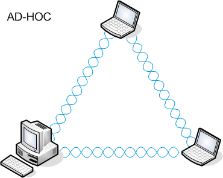
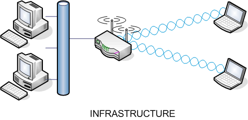

# Punto de acceso

Un **punto de acceso (Access Point o AP)** es un dispositivo de red que permite la conexión inalámbrica de equipos (como laptops, móviles, impresoras) a una red local (LAN) y, opcionalmente, a Internet. Su función principal es actuar como un puente entre una red cableada (como una LAN con cables Ethernet) y dispositivos inalámbricos como laptops, smartphones, tablets, etc.

## Funciones:
- Publicar una WLAN para que otros dispositivos puedan conectarse.
- Gestionar las conexiones y asignar direcciones IP (si tiene funciones de router o DHCP).
- Autenticar dispositivos que se conectan a la red.
- Ofrecer cifrado y seguridad (WPA2, WPA3...).
- Ampliar la cobertura de la red inalámbrica si actúa como repetidor.

## Dispositivo multifunción en WLAN

## Definición:
Un **dispositivo multifunción** en redes WLAN es un equipo que **combina varias funciones de red** en uno solo, típicamente: **punto de acceso, router, switch y servidor DHCP**. Es muy común en entornos domésticos.

## Diferencias respecto a un punto de acceso:

| Punto de acceso (AP)                     | Dispositivo multifunción                  |
|------------------------------------------|--------------------------------------------|
| Solo permite la conexión inalámbrica     | Integra funciones de AP, router y más      |
| No enruta tráfico entre redes            | Puede enrutar tráfico entre LAN e Internet |
| No asigna IPs (sin servidor DHCP)        | Puede asignar IPs a través de DHCP         |
| Normalmente depende de un router         | Funciona de forma independiente            |

---

## Modos de operación y tipos de redes

El estándar **IEEE 802.11** define dos modos de operación que dan lugar a **dos tipos de redes inalámbricas**:

### Redes Ad Hoc

#### Descripción:
Son redes **descentralizadas** donde los dispositivos se comunican **directamente entre sí**, sin necesidad de un punto de acceso. Se usan para conexiones temporales, como compartir archivos entre dos portátiles.

### Redes en Infraestructura

#### Descripción:
Son redes en las que los dispositivos se conectan **a través de un punto de acceso (AP)**. Es el modo más común en oficinas, hogares y espacios públicos con Wi-Fi.

## Parámetros de configuración de los puntos de acceso.

### SSID

El SSID (Service Set Identifier) es un **identificador lógico** que distingue una red inalámbrica específica dentro de un entorno Wi-Fi. Funciona como una etiqueta que permite a los dispositivos cliente identificar y seleccionar la red a la que desean conectarse.

#### Detalles técnicos:

El SSID es un campo incluido en los paquetes que transmite un punto de acceso (Access Point) de forma periódica para anunciar la presencia de la red.

Tiene una longitud máxima de 32 bytes y puede contener letras, números y algunos caracteres especiales.

#### Tipos de SSID:

* **Broadcast SSID (Visible)**: El punto de acceso anuncia su SSID y los dispositivos pueden verlo en la lista de redes disponibles.

* **Hidden SSID (Oculto)**: El punto de acceso omite el SSID. Esto no ofrece seguridad real, pero puede dificultar la detección de la red para usuarios no autorizados.

#### Importancia del SSID:

- **Identificación de red**: Permite que múltiples redes coexistan en un mismo entorno físico (por ejemplo, en un edificio de oficinas). 
- **Asociación de dispositivos**: Un cliente Wi-Fi debe conocer y coincidir el SSID para poder autenticarse y asociarse a la red.
- **Segmentación de servicios**: Algunos puntos de acceso permiten configurar múltiples SSID sobre la misma infraestructura física, cada uno asociado a una VLAN distinta para separar el tráfico (por ejemplo, SSID para empleados y otro para invitados).

### Autenticación

La autenticación en redes WiFi sirve para verificar la identidad de los dispositivos que intentan conectarse a un punto de acceso, asegurando que solo usuarios autorizados puedan acceder a la red.

Algunos de los tipos de autenticación existentes son:

## 1. Open System (Sistema Abierto)

- No requiere autenticación previa.
- Cualquier cliente puede conectarse sin proporcionar credenciales.
- No se cifra la información por defecto.
- Solo permite el acceso si el cliente conoce el nombre de la red (SSID).

## 2. WEP (Wired Equivalent Privacy)

- Primer estándar de seguridad para redes WiFi. 
- Implementa autenticación por clave compartida (pre-shared key).
- No cambia dinámicamente la clave: es estática para todos los clientes.
- Vulnerable a ataques de recuperación de clave (ataques FMS, airecrack-ng, etc.).
- Considerado obsoleto y no seguro desde hace años.

## 3. WPA (Wi-Fi Protected Access)

- Introducido como solución temporal a las fallas de WEP.
- Usa el protocolo **TKIP** (Temporal Key Integrity Protocol) para cifrado dinámico. TKIP genera una nueva clave por cada paquete transmitido.Esto evita que se repitan claves, 
- Más seguro que WEP, pero actualmente considerado vulnerable frente a ataques modernos.
- Ya no se recomienda su uso en nuevas implementaciones.

## 4. WPA2 (Wi-Fi Protected Access 2)

- Sustituye TKIP por AES (Advanced Encryption Standard), un algorítmo criptográfico mucho más dificil de romper.
- Dos modos disponibles:
  - WPA2-PSK: usa una clave compartida, común en **redes domésticas**.
  - WPA2-Enterprise: emplea autenticación mediante 802.1X y servidor RADIUS, ideal para entornos corporativos.
- Considerado seguro durante muchos años, aunque presenta vulnerabilidades si no se actualiza adecuadamente.
- Sigue siendo el estándar más utilizado actualmente.

## 5. WPA3

- Estándar más reciente, presentado en 2018. Mejora aún más el nivel de seguridad
- Requiere hardware compatible (especialmente para WPA3-Personal).
- Recomendado para nuevas redes por su robustez ante ataques modernos.

WPA2 sigue siendo más usado que WPA3 por su amplia compatibilidad, menor requerimiento de hardware nuevo, y porque muchas redes aún no consideran prioritaria la actualización, a pesar de las ventajas claras de seguridad que ofrece WPA3.

## Comparativa Técnica

| Algoritmo | Cifrado        | Tipo de autenticación     | Seguridad       | Estado actual       |
|-----------|----------------|----------------------------|------------------|----------------------|
| Open      | Ninguno        | Ninguno                    | Muy baja         | Obsoleto             |
| WEP       | RC4 (estático) | Clave compartida           | Baja             | Obsoleto             |
| WPA       | TKIP           | PSK / 802.1X               | Media            | No recomendado       |
| WPA2      | AES-CCMP       | PSK / 802.1X               | Alta             | Muy utilizado        |
| WPA3      | AES-CCMP / SAE | SAE / 802.1X (192 bits)    | Muy alta         | Recomendado          |

