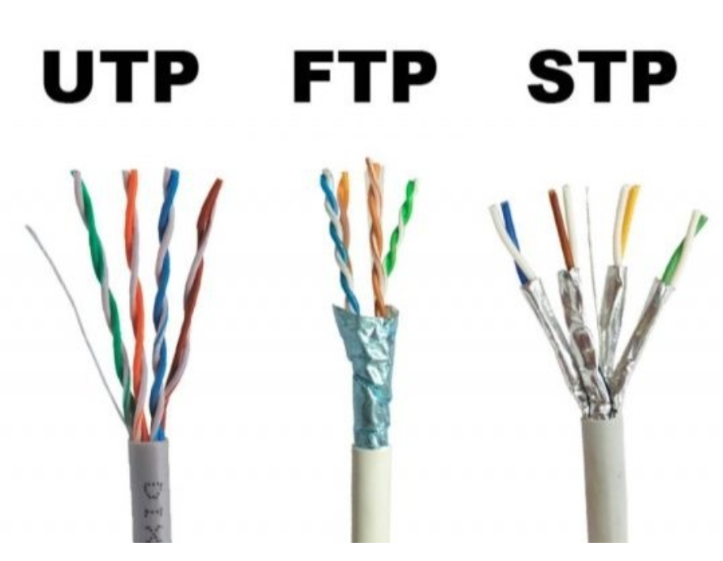
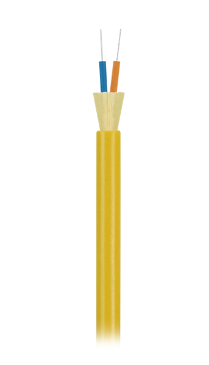
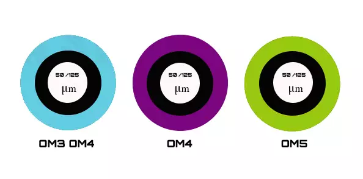
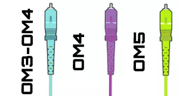
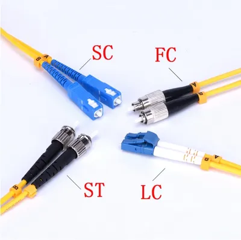
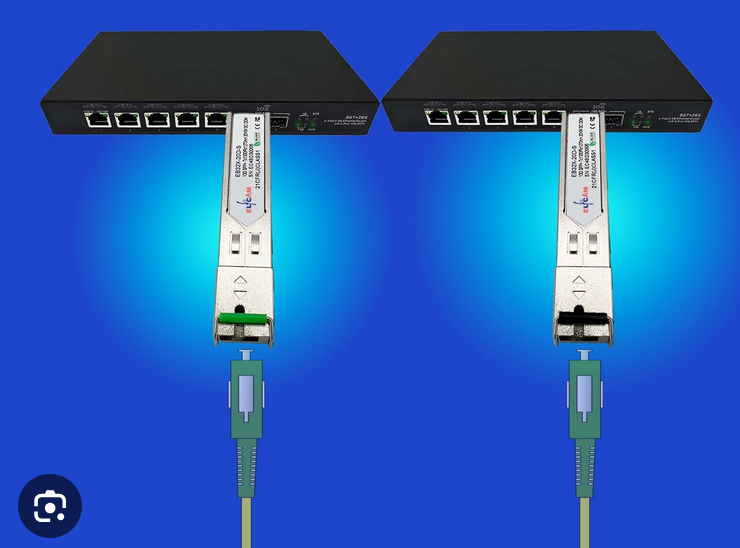

# Cableado utilizado en redes locales

En una **red local (LAN)**, el tipo de **cableado más comúnmente utilizado** es el **cable de par trenzado de cobre**, especialmente para el **cableado horizontal** que conecta las tomas de red con el armario de comunicaciones. También pueden usarse otros tipos según necesidades específicas.

## Tipos de cableado más utilizados en una red local

### 1. Cable de par trenzado (UTP, FTP, STP)

Es el más habitual en redes LAN debido a su **versatilidad, bajo coste y facilidad de instalación**.

El apantallamiento es una capa metálica conductora (normalmente aluminio o cobre) que se coloca envolviendo al cableado.

Esta malla o lámina metálica absorbe y desvía las interferencias eléctricas, mejorando la calidad de la señal.

| Tipo    | Descripción                                  | Uso común                                 |
| ------- | -------------------------------------------- | ----------------------------------------- |
| **UTP** | Par trenzado sin apantallamiento             | Oficinas, aulas, viviendas                |
| **FTP** | Par trenzado con pantalla general            | Ambientes con ruido eléctrico             |
| **STP** | Par trenzado con pantalla individual por par | Industrias o zonas con alta interferencia |

#### Categoría del cable de par trenzado

La categoría de un cable determina:
- La frecuencia de operación máxima (en MHz).
- La velocidad de transmisión de datos (en Mbps o Gbps).
- El tipo de tecnología Ethernet que soporta (Fast Ethernet, Gigabit, 10 Gigabit...).
- Los requisitos físicos (resistencia a interferencias, atenuación, diafonía...).

#### Categorías más utilizadas:

En las redes locales que se instalan actualmente las categorías de cable más utilizadas son

| Categoría   | Velocidad / Frecuencia                           | Uso típico                                    |
| ----------- | ------------------------------------------------ | --------------------------------------------- |
| **Cat 5e**  | Hasta 1 Gbps / 100 MHz                           | Oficinas básicas, obsoleto pero aún común     |
| **Cat 6**   | Hasta 1 Gbps (100 m) o 10 Gbps (≤55 m) / 250 MHz | Estándar actual en instalaciones modernas     |
| **Cat 6A**  | Hasta 10 Gbps / 500 MHz                          | Centros de datos, redes exigentes             |
| **Cat 7/8** | 10–40 Gbps (poco usado en LANs normales)         | Muy alta velocidad, normalmente para cableado vertical (backbone) |

### 2. Fibra óptica (monomodo o multimodo)

En redes locales (**LANs**), aunque lo más común sigue siendo el cableado de cobre (UTP/FTP), el uso de **fibra óptica** ha aumentado especialmente en:

* **cableado vertical o enlaces troncales** entre racks, plantas o edificios.
* **Centros de datos**
* Redes que requieren **altas velocidades**, **larga distancia** o **inmunidad a interferencias**.

Entre sus ventajas están mayor velocidad, mayor distancia, inmunidad a interferencias.

El cableado de fibra óptica no se suele usar para tomas de usuario.
 

#### Tipos de cableado de fibra óptica en redes locales

##### 1. Según el tipo de fibra

Existen dos tecnologías según el tipo de fibra:
| Tipo de fibra      | Descripción                                                             | Uso en redes locales                                                |
| ------------------ | ----------------------------------------------------------------------- | ------------------------------------------------------------------- |
| **Multimodo (MM)** | Núcleo más grueso (50/125 o 62,5/125 µm), transmite varios modos de luz | El más usado en LANs, enlaces cortos (≤ 550 m)                    |
| **Monomodo (SM)**  | Núcleo muy fino (9/125 µm), transmite un solo modo de luz               | Usado en enlaces de larga distancia (>1 km), menos común en LANs |

Ambas se suelen utilizar en redes locales, normalmente para los enlaces se usan dos fibras (duplex): una para transmitir (Tx) y otra para recibir (Rx), lo que permite enviar y recibir de forma simultanea.

##### 1.1. Tipo de fibra monomodo

En redes locales (LAN), el uso de **fibra monomodo (SM, *Single Mode*)** es **menos habitual que la multimodo**, pero **sí se emplea en casos específicos**, sobre todo cuando se necesita:

* **Alcanzar distancias largas** (más de 500 metros o entre edificios).
* Tener una red con **alta capacidad y baja latencia**.
* Prepararse para velocidades de **10, 25, 40 o incluso 100 Gbps**.

Actualmente en redes locales suele utilizarse fibra óptica monomodo tipo **OS1**. Sus características más importantes son:

* Fibra monomodo **para interior** (ductos, edificios, instalaciones cerradas).
* Núcleo de **9/125 µm** 
* Se suelen utilizar **conectores LC o SC**
* Color del revestimiento: **amarillo**
* Distancias: hasta **10 km** para 1 Gbps.
* Uso: redes LAN grandes, verticales (entre plantas), backbones dentro de edificios.

##### 1.2. Tipo de fibra multimodo

| Tipo    | Diámetro / Norma           | Color común  | Velocidad máxima típica                | Aplicación                |
| ------- | -------------------------- | ------------ | -------------------------------------- | ------------------------- |
| **OM1** | 62,5/125 µm                | Naranja      | Hasta 1 Gbps (hasta 300 m)             | Obsoleto                  |
| **OM2** | 50/125 µm                  | Naranja      | Hasta 1 Gbps (hasta 600 m)             | Obsoleto                  |
| **OM3** | 50/125 µm láser optimizada | Aqua         | Hasta 10 Gbps (hasta 300 m)            | Estándar actual           |
| **OM4** | 50/125 µm premium          | Violeta/Aqua | Hasta 10 Gbps (hasta 550 m)            | Recomendado               |
| **OM5** | 50/125 µm especial (WDM)   | Verde claro  | Hasta 100 Gbps (tecnologías avanzadas) | Centros de datos modernos |

 **OM3 y OM4** son las más comunes en redes locales actuales. 
 
 > El color oficial del revestimiento (jacket) para **OM3** y **OM4** según la normativa era **aqua** (turquesa). Esto provocaba confusión entre OM3 y OM4, ya que ambos compartían el mismo color, pese a tener diferentes rendimientos. Para evitar errores en instalaciones y facilitar la identificación visual, muchos fabricantes adoptaron el color **violeta** (o púrpura) como color distintivo para **OM4**.

##### 3. Tipos de conectores de fibra más usados en LANs

Los conectores de fibra que se suelen utilizar en fibra óptica son:

| Conector | Descripción              | Aplicación común                        |
| -------- | ------------------------ | --------------------------------------- |
| **LC**   | Pequeño, moderno, dúplex | Muy usado en LANs y switches de fibra |
| **SC**   | Más grande, tipo “click” | Instalaciones antiguas o económicas     |
| **ST**   | Tipo bayoneta, redondo   | Antiguo, ya poco común                  |

##### 4. Transceptores de fibra óptica

Un transceptor de fibra (también llamado módulo óptico o módulo **SFP**) es un dispositivo electrónico que **convierte señales eléctricas en señales ópticas y viceversa**, permitiendo la comunicación a través de cables de fibra óptica.

Se instala en un puerto compatible de un switch, router o equipo de red. Su función es enviar (transmitir) y recibir datos usando luz a través de la fibra. Permite adaptar un equipo a diferentes tipos de fibra, velocidades y distancias sin cambiar el hardware completo.

