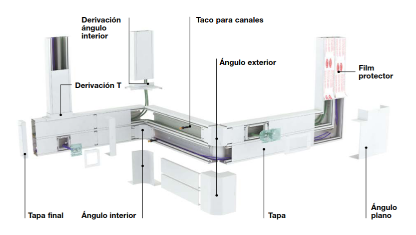
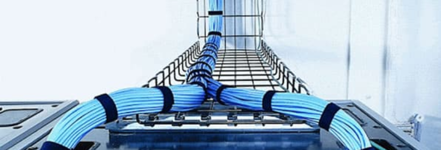
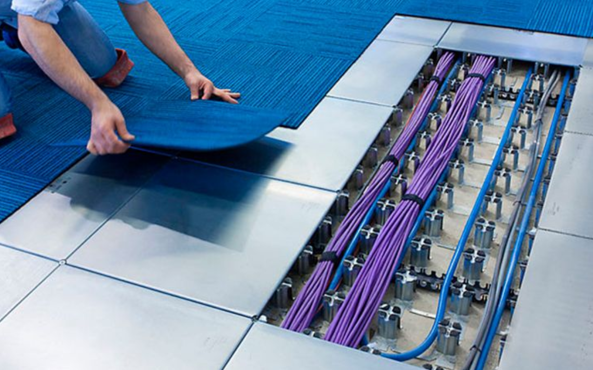
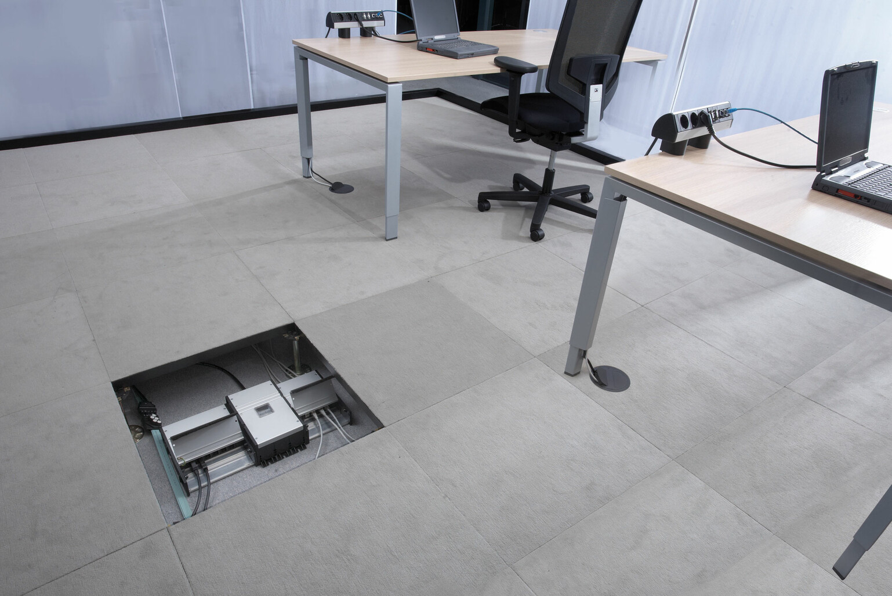

# Espacios y elementos de cableado estructurado en instalación de pequeño tamaño (1 local)

En una instalación de red local pequeña limitada a un local, la infraestructura de **cableado estructurado** debe contemplar tanto los **espacios físicos** como los **elementos** que permiten una conectividad eficiente, organizada y escalable. A continuación, se describen los **elementos principales** y los **espacios necesarios**:

## Espacios de la instalación

1. **Sala de telecomunicaciones (cuarto de comunicaciones):**

   * Pequeño armario o rack donde se centralizan los equipos de la red local.
   * Puede estar en un armario mural si el espacio es muy reducido.

2. **Área de trabajo:**

   * Es la zona donde los usuarios finales se conectan a la red. 
   * Espacio físico que comprende los puestos de trabajo con dispositivos como ordenadores, teléfonos, impresoras en red, etc., 
   * Está conectado al resto de la red mediante el cableado horizontal.

Comprende:

   * Tomas de red (RJ-45) instaladas en pared, suelo, mobiliario, etc
   * Latiguillos de conexión que unen la toma con el equipo del usuario.
   * Equipos terminales del usuario (PC, impresora, teléfono IP...).
   * Mobiliario y elementos que forman parte del entorno funcional (mesa, silla, canaleta...).

3. **Canalizaciones:**

Son los elementos encargados de: 

* **Proteger** los cables frente a daños mecánicos, humedad, interferencias, calor o aplastamiento.
* **Guiar** los cables por recorridos planificados (paredes, suelos, techos, columnas).
* **Separar** cables de distintas funciones (datos, energía, control) según normativa.
* Permitir **mantenimiento y ampliación** sin necesidad de rehacer la instalación.

Los tipos de canalizaciones más comunes son: 
| Tipo de canalización              | Descripción                                      | Uso típico                                    |
| --------------------------------- | ------------------------------------------------ | --------------------------------------------- |
| **Canaleta**                      | Conducto superficial de PVC o metálico con tapa  | Oficinas, aulas, paredes o rodapié            |
| **Bandeja portacables**           | Estructura abierta metálica (rejilla o escalera) | Falsos techos, racks, centros de datos        |
| **Tubo corrugado o rígido**       | Tubería empotrada en pared o suelo               | Viviendas, obra nueva, canalizaciones ocultas |
| **Suelos técnicos / cajas suelo** | Espacios bajo suelo elevado con registros        | Oficinas con distribución flexible            |

4. **Puntos de consolidación (opcional):**

   * Si el local es grande, se pueden usar cajas de distribución intermedias para facilitar el despliegue.
   * Se suelen usar en zonas en las que los espacios suelen modificarse como oficinas abiertas, aulas móviles o salas polivalentes. Permite mayor flexibilidad en la distribución de tomas de red.
   * El cableado horizontal desde el patch panel (en el rack o armario mural) llega al punto de consolidación.* En el punto de consolidación se instalan conectores hembra RJ-45 (tipo módulo o caja).
   * Desde ahí, se tienden cables flexibles (latiguillos o tramos cortos) hasta las tomas de usuario.
   * En función de los espacios ocupados en el punto de consolidación se conectan latiguillos para dar conectividad a los mismos.

##  Elementos del cableado estructurado (red de un solo local)

**Cableado horizontal:**

   * Cableado que va desde el rack o armario de comunicaciones hasta cada área de trabajo.
   * Generalmente es **cable UTP categoría 6**.

**Panel de parcheo o patch panel:**

   * Panel de conexiones que permite organizar y etiquetar cada cable de red.
   * Se ubica en el armario de comunicaciones.
   * Conectado al switch mediante latiguillos (patch cords).

**Switch de red:**

   * Dispositivo que interconecta todos los puntos de red dentro del local.
   * Puede ser gestionado o no, dependiendo de las necesidades.

**Tomas de red (tomas RJ-45):**

   * Conector tipo RJ-45 (hembra) instalado normalmente en una caja empotrada o superficie, conectada internamente al cableado horizontal que llega desde el armario o rack de comunicaciones.

**Latiguillos (patch cords):**

   * Cables cortos que conectan los dispositivos de usuario a las tomas de red, y el switch al patch panel.

**Sistema de puesta a tierra:**

   * Consiste en conectar físicamente ciertas partes metálicas de la instalación eléctrica y de red a un punto común que se encuentra a potencial cero, es decir, a la tierra. Esto permite que cualquier corriente no deseada se desvíe de forma segura hacia el suelo.
   * Muy importante para evitar interferencias y proteger los equipos.

**Etiquetado y documentación:**

   * Proceso de identificar de forma clara y permanente todos los componentes de la red, con el fin de facilitar:
     - El mantenimiento y la resolución de problemas.
     - Las ampliaciones o modificaciones de la red.
     - El cumplimiento de normativas y buenas prácticas.

