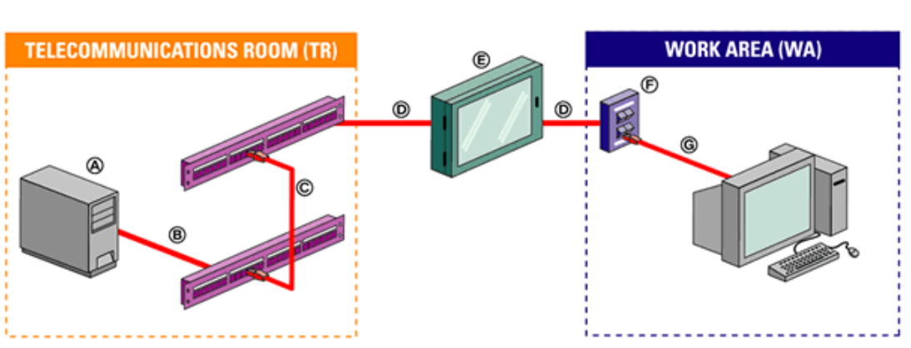

# Espacios y elementos de cableado estructurado en instalación de pequeño tamaño (1 local)

En una instalación de red local pequeña limitada a un local, la infraestructura de **cableado estructurado** debe contemplar tanto los **espacios físicos** como los **elementos** que permiten una conectividad eficiente, organizada y escalable. A continuación, se describen los **elementos principales** y los **espacios necesarios**:

## Espacios de la instalación

1. **Sala de telecomunicaciones (cuarto de comunicaciones):**

   * Pequeño armario o rack donde se centralizan los equipos activos (switch, router, patch panel).
   * Puede estar en un armario mural si el espacio es muy reducido.

2. **Área de trabajo:**

   * Espacios donde se ubican los puestos de usuario (ordenadores, impresoras, teléfonos IP...).

3. **Canalizaciones:**

   * Bandejas, tubos o canaletas para organizar el paso del cableado.
   * Deben permitir mantenimiento y futuras ampliaciones.

4. **Puntos de consolidación (opcional):**

   * Si el local es grande, se pueden usar cajas de distribución intermedias para facilitar el despliegue.

##  Elementos del cableado estructurado

**Cableado horizontal:**

   * Cableado que va desde el rack o armario de comunicaciones hasta cada área de trabajo.
   * Generalmente es **cable UTP categoría 6**.

**Panel de parcheo o patch panel:**

   * Panel de conexiones que permite organizar y etiquetar cada cable de red.
   * Se ubica en el armario de comunicaciones.
   * Conectado al switch mediante latiguillos (patch cords).

**Switch de red:**

   * Dispositivo que interconecta todos los puntos de red dentro del local.
   * Puede ser gestionado o no, dependiendo de las necesidades.

**Tomas de red (tomas RJ-45):**

   * Conector tipo RJ-45 (hembra) instalado normalmente en una caja empotrada o superficie, conectada internamente al cableado horizontal que llega desde el armario o rack de comunicaciones.

**Latiguillos (patch cords):**

   * Cables cortos que conectan los dispositivos de usuario a las tomas de red, y el switch al patch panel.

**Sistema de puesta a tierra:**

   * Consiste en conectar físicamente ciertas partes metálicas de la instalación eléctrica y de red a un punto común que se encuentra a potencial cero, es decir, a la tierra. Esto permite que cualquier corriente no deseada se desvíe de forma segura hacia el suelo.
   * Muy importante para evitar interferencias y proteger los equipos.

**Etiquetado y documentación:**

   * Proceso de identificar de forma clara y permanente todos los componentes de la red, con el fin de facilitar:
     - El mantenimiento y la resolución de problemas.
     - Las ampliaciones o modificaciones de la red.
     - El cumplimiento de normativas y buenas prácticas.

