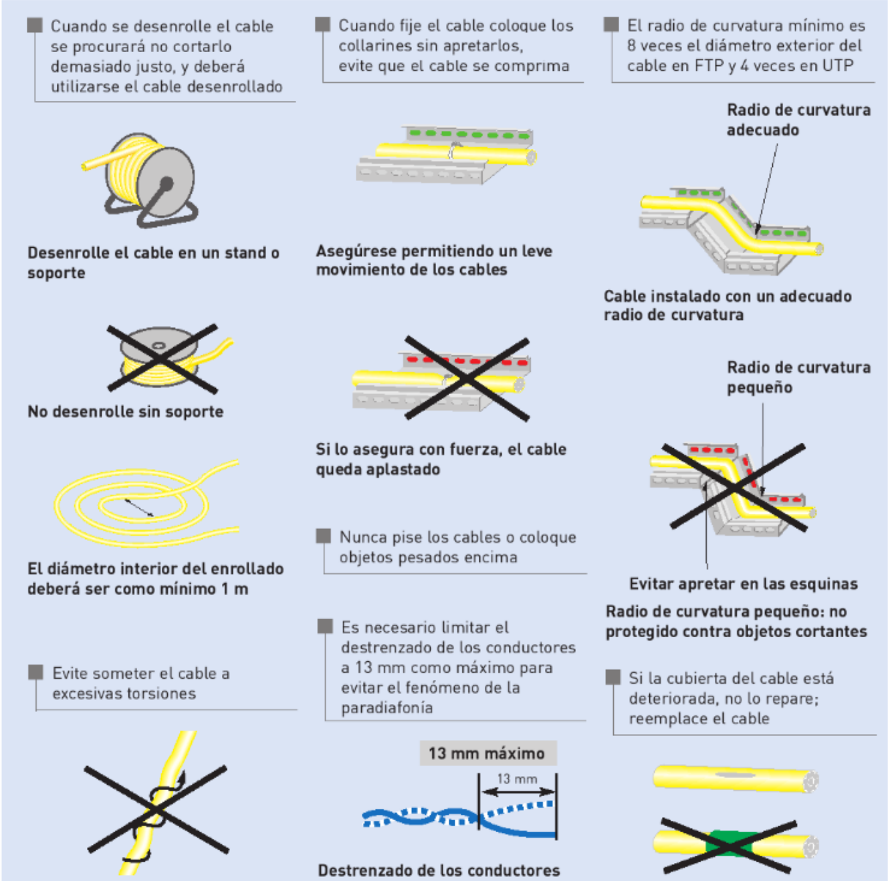

# Criterios y restricciones aplicables a los elementos y espacios de un sistema de cableado estructurado

La normativa en la instalación y diseño de un sistema de cableado estructurado sirve para garantizar la **calidad**, **seguridad**, **eficiencia** y **escalabilidad** de la red. 

Aplicar normas reconocidas evita problemas técnicos, facilita el mantenimiento y asegura que la infraestructura cumpla con los estándares exigidos por fabricantes, operadores y legislaciones.

Las normas son como una “guía de buenas prácticas” basada en experiencia técnica, y su aplicación evita errores comunes, reduce costes a largo plazo y mejora la calidad del servicio.

Las normas más comunes aplicables al cableado estructurado son:

| Norma             | Propósito principal                                         |
| ----------------- | ----------------------------------------------------------- |
| **UNE-EN 50173**  | Define el diseño del cableado de telecomunicaciones.        |
| **UNE-EN 50174**  | Normas para la instalación de infraestructuras de cableado. |
| **TIA/EIA-568**   | Estándar norteamericano para cableado estructurado.         |
| **TIA/EIA-606**   | Sistema de etiquetado y gestión de redes.                   |
| **REBT (España)** | Reglamento de seguridad eléctrica.                          |
| **ISO/IEC 11801** | Estándar internacional de cableado para edificios.          |

## Normativa aplicable a espacios

Vamos a ver para cada uno de los espacios definidos para una pequeña red local las restricciones que impone la normativa de forma resumida.

### Armario mural de telecomunicaciones

| Requisito                                | Valor recomendado/normativo                                    |
| ---------------------------------------- | -------------------------------------------------------------- |
| Altura del armario mural                 | 1,20 m – 1,80 m desde el suelo                                 |
| Espacio libre frontal                    | Mínimo 1 metro                                                 |
| Espacio libre lateral y superior          | Mínimo 15-20cm para ventilación y paso de cables |
| Espacio reservado para crecimiento futuro | Al menos 1U adicional por cada 3–4U ocupadas |
| Separación con canalizaciones eléctricas | Mínimo 30 cm (sin apantallamiento)                             |
| Acceso                                   | Sin obstáculos, con apertura total de puerta                   |
| Temperatura ambiente máxima | 32ºC |
| Ventilación                              | Rejillas o ventilador; evitar zonas cerradas sin flujo de aire |
| Seguridad                                | Cierre con llave; uso exclusivo telecomunicaciones             |
| Puesta a tierra del armario              | Obligatoria si es metálico                                     |

### Área de trabajo

| Elemento                       | Requisito según normativa                            |
| ------------------------------ | ---------------------------------------------------- |
| Tomas por puesto               | Mínimo 2 RJ-45       |
| Categoría mínima del cableado  | Cat 5e (recomendado Cat 6 o superior)                |
| Altura mínima de tomas (pared) | 30 cm desde el suelo                                 |
| Etiquetado                     | Obligatorio en ambos extremos (toma y patch panel)   |

### Canalizaciones

| Aspecto                          | Requisito / Recomendación                                         |
| -------------------------------- | ----------------------------------------------------------------- |
| Accesibilidad                    | Deben permitir acceso para mantenimiento                          |
| Curvatura                        | Respetar radios mínimos (no doblar cables en exceso)              |
| Carga máxima inicial             | No superar el 50 % de capacidad útil de la canalización           |
| Separación con cables eléctricos | Mínimo 30 cm o canaletas separadas/apantalladas                   |
| Identificación                   | Canaletas y tubos deben estar identificados (datos, voz, etc.)    |
| Distribución compartida          | No compartir canalizaciones con otros servicios (agua, gas, etc.) |
| Protección mecánica              | Canalizaciones resistentes a impactos o agresiones externas       |
| Cruces con electricidad          | En ángulo recto y separadas físicamente                           |

Otros aspectos a tener en cuenta:

- Los cables deben ir fijados en capas mediante abrazaderas colocadas a intervalos de 4 metros.
- Su anchura ha de ser como mínimo el doble de la anchura necesaria para albergar el cable actual.
- Las canaletas no tendrán una profundidad superior a 15 cm. De esta forma se evita el aplastamiento de los cables
por sobrepeso.
- Para el dimensionamiento de las canalizaciones, se realizará en base a 80 mm2 por cada área de trabajo (2 cables) a la que de servicio dicha canalización.

### Puntos de consolidación

| Requisito                   | Descripción                                              |
| --------------------------- | -------------------------------------------------------- |
| Uso específico | Sólo se permite en el cableado horizontal |
| Uso específico | para facilitar cambios frecuentes de distribución, no como ahorro de material |
| Ubicación fija              | Montado en estructura, no accesible al usuario (pared, columna, suelo técnico o techo técnico)          |
| Conexión modular            | Conector hembra (RJ-45) o caja de conexión               |
| Prohibido empalmar cables   | No se permiten empalmes directos entre tramos            |
| Documentación y etiquetado  | Obligatorio                                              |
| Categoría del componente    | Igual o superior a la del cableado (Cat 6, Cat 6A…)      |
| Longitud total canal ≤ 90 m | Incluyendo desde el panel hasta la toma del usuario      |
| Tramo desde PC a toma       | Recomendado ≤ 20 m                                       |
| Separación del distribuidor de planta | >= 15 m |
| Cantidad por canal          | Máximo **1 punto de consolidación** por canal horizontal |

## Normativa aplicable a elementos del cableado estructurado

### Cableado horizontal

| Requisito                          | Valor / Recomendación                                   |
| ---------------------------------- | ------------------------------------------------------- |
| Longitud máxima                    | 90 m (sin contar latiguillos)                           |
| Latiguillos                        | Hasta 10 m (5 m en cada extremo)                        |
| Categoría mínima                   | Cat 5e (recomendado Cat 6 o superior)                   |
| Empalmes                           | No permitidos, salvo punto de consolidación justificado |
| Instalación                        | Sin tensión, con radios de curvatura adecuados          |
| Etiquetado                         | En ambos extremos (patch panel y toma de usuario)       |
| Documentación                      | Obligatoria: planos, tablas y esquemas                  |
| Certificación final                | Con comprobadores de cableado homologados               |

#### Separación del cableado con elementos generadores de interferencias electromagnéticas

Para evitar las interferencias electromagnéticas, los cables de datos de par trenzado tendrán que estar separados de los
elementos que la generan por una distancia mínima que se indica en la siguiente tabla:

| Elemento genrador de interferencias | Distancia mínima |
| -- | -- |
| Transformadores, motores eléctricos grandes, aires acondicionados, ... | 120 cm |
| Fluorescentes | 12 cm |
| intercomunicadores y similares | 12 cm |

#### Separación con líneas eléctricas

En cuanto a la separación, dentro de las canalizaciones, entre cableado de datos y cableado de red de alimentación
(corriente), la norma establece las siguientes separaciones:

| Condición                                                                 | Separación mínima recomendada |
| ------------------------------------------------------------------------- | ----------------------------- |
| Cables de datos **sin apantallamiento (UTP)** y eléctricos sin protección | **≥ 200 mm (20 cm)**          |
| Cables de datos **apantallados (FTP/STP)**                                | **≥ 50 mm (5 cm)**            |
| Cables en **bandejas metálicas separadas**                                | **≥ 30 mm (3 cm)**            |
| **Canalización compartida con separador metálico certificado**            | Permitido (sin distancia)   |

Las distancias pueden ser menores con el cableado eléctrico si se utilizan cables apantallados:
- Para cableado de datos apantallado, si el cableado horizontal es menor a 35 metros no requiere separación.
- En cualquier tipo de cable, no es necesario separación en los últimos 15 metros más cercanos a la roseta.

### Tendido del cableado

### Cuartos de telecomunicaciones

- Cada cuarto debe tener acceso directo al cableado troncal
- No debe contener otras instalaciones eléctricas que no sean del equipamiento propio del cuarto.
- Deben disponer de acometida eléctrica diferenciada, apantallamiento frente a interferencias electromagnéticas, sistemas de alimentación interrumpida, sistema de luz de emergencia y ventilación adecuada.
- La temperatura debe mantenerse permanentemente entre 10 y 35 grados centígrados y la humedad
relativa debe mantenerse por debajo del 85%, realizándose un cambio completo de aire por hora.

### Armarios de comunicaciones

- Se debe dejar un mínimo de 1,2 m de espacio libre alrededor de las puertas de los armarios para poder maniobrar con comodidad.
- Entre el lateral del último armario y la pared existirá como mínimo 0,50 m de separación.

### Puesta a tierra

La puesta a tierra es fundamental para evitar daños a personas y equipos de red provocados por corrientes eléctricas no esperadas.

También son importantes en el cable apantallado, ya que este actúa de antena y las interferencias electromagnéticas generan corrientes en el apantallamiento. Si esta corriente no se deriva a tierra, el efecto de apantallamiento se ve gravemente perjudicado y, además, se convierte en una fuente de peligro eléctrico para personas y equipos.

Todos los armarios, equipos, cables apantallados y sistemas eléctricos deben contar con sus correspondientes tomas de conexión a red, las cuales deben estar unidas al sistema de puesta a tierra del edificio. Este sistema de tierra debe ser funcional y tener capacidad para derivar adecuadamente las corrientes de fuga o interferencias de todos los elementos conectados.

### Paneles de parcheo

| Elemento                  | Requisito / Normativa aplicable                                     |
| ------------------------- | ------------------------------------------------------------------- |
| Categoría del panel       | Igual o superior al cableado (Cat 5e, 6, 6A...)                     |
| Tipo de conectores        | RJ-45 hembra                               |
| Instalación física        | Montado en rack/armario mural, sin tensión en los cables            |
| Organización del cableado | Uso de organizadores y guías de cable                               |
| Capacidad de puertos | Reserva mínima del 25% de los puertos en los paneles de parcheo |
| Etiquetado                | Obligatorio, único, visible, según TIA/EIA-606-B                    |
| Documentación             | Plano y tabla de correspondencias puerto-toma                       |
| Certificación funcional   | Pruebas de continuidad, diafonía (NEXT), pérdida de inserción, etc. |
| Accesibilidad             | Debe permitir parcheo y mantenimiento sin obstrucciones             |

### Tomas de red

| Elemento                      | Requisito / Norma aplicable                         |
| ----------------------------- | --------------------------------------------------- |
| Mínimo por puesto de trabajo  | 2 tomas RJ-45                      |
| Categoría mínima              | Igual o superior al cableado (Cat 5e, 6, 6A…)                  |
| Altura de instalación (pared) | ≥ 30 cm del suelo                  |
| Tipo de conector              | RJ-45 hembra                       |
| Empalmes                      | Prohibidos entre panel y toma                       |
| Radio de curvatura del cable  | Mínimo 4× el diámetro del cable al llegar a la toma |
| Etiquetado                    | Obligatorio                          |
| Documentación                 | Obligatoria en plano/red                            |
| Accesibilidad                 | No deben estar ocultas o detrás de mobiliario fijo  |

### Latiguillos o patch cords

| Elemento                    | Requisito / Norma aplicable                            |
| --------------------------- | ------------------------------------------------------ |
| Categoría mínima            | Igual o superior a la del cableado (UNE-EN 50173-1)    |
| Longitud máxima recomendada | 5 m por extremo / 10 m en total (TIA/EIA-568-C.2)      |
| Tipo de conector            | RJ-45 certificado, prensado de fábrica (ISO/IEC 11801) |
| Instalación física          | Sin tensión, sin dobleces bruscos (UNE-EN 50174-2)     |
| Radio de curvatura mínimo   | 4× el diámetro del cable                               |
| Empalmes/modificaciones     | No permitidos en latiguillos                           |
| Etiquetado                  | Recomendado (TIA/EIA-606-B)                            |

