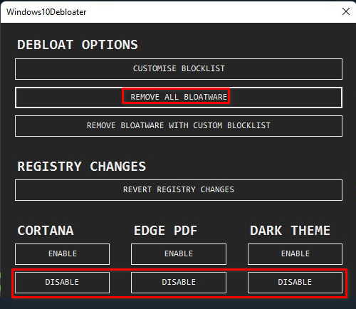

# Debloat windows

El bloatware es el software que viene preinstalado en dispositivos, especialmente en computadoras y teléfonos inteligentes, que ocupa espacio innecesario o consume recursos sin ofrecer un valor significativo al usuario. Suele incluir aplicaciones que el usuario no ha solicitado, no necesita o raramente usa

Para desinstalar el bloatware que viene en las versiones 10 y 11 de Windows lo podemos hacer abriendo un terminal de Powershell del usuario y ejecutar en el mismo:

```
iwr -useb https://git.io/debloat|iex
```

Se descargará y ejecutará un programa en el que podemos seleccionar los componentes preinstalados que queremos desinstalar o deshabilitar.

Seleccionando las opciones marcadas en la siguiente captura debería ser suficiente:


